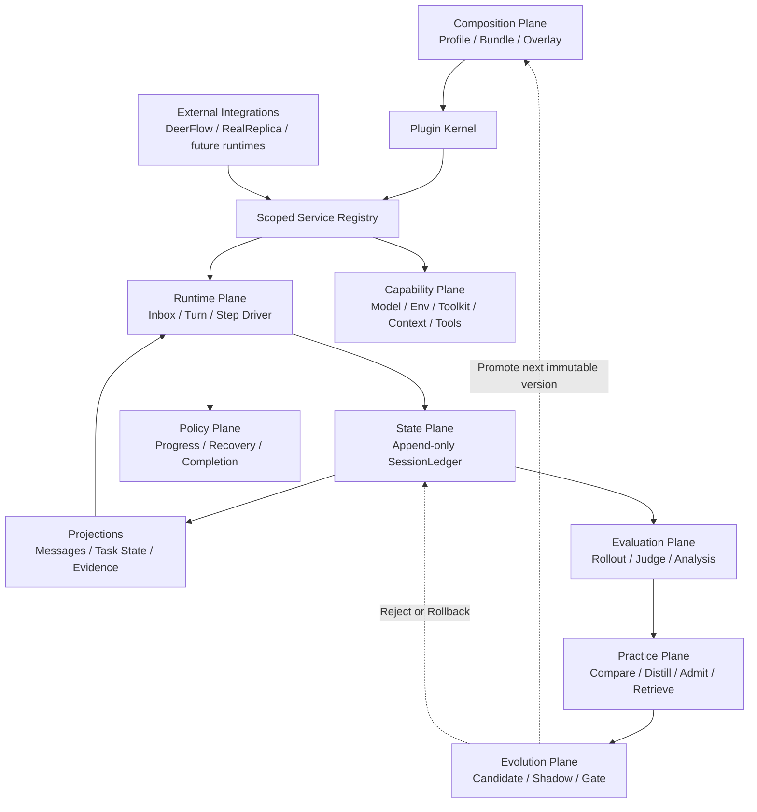

# Architecture

## Non-negotiable invariants

1. **Model-visible means ledger-backed.** Model messages are derived from the
   append-only ledger; no hidden side channel may change a request.
2. **Capabilities are services.** Consumers depend on a `ServiceKey`, not a
   concrete provider.
3. **Every registration is reversible.** Plugin teardown removes services and
   listeners in reverse order.
4. **Turn and Step differ.** A Turn may contain several model/tool Steps.
5. **Runtime and evaluation are separate.** Verifiers/rewards never enter the
   online runtime state.
6. **Learning is offline and admissibility-gated.** Experience never stores a
   benchmark task id, selector, verifier wording, or expected answer.
7. **Core is environment-agnostic.** Task ontologies and external protocols
   enter through integration extractors/providers, never through Core rules.
8. **Profiles are immutable at runtime.** Evolution creates a new version in
   Shadow; only an evidence-gated control-plane decision can promote it.
9. **Context is selected, not accumulated.** Immutable instructions and tool
   protocol groups survive; untrusted runtime facts never gain system authority.

## Planes



## Reference mapping

| Reference | Adopt | Do not copy |
|---|---|---|
| DeepSeek Harness | plugin tree, service keys, reversible effects, scoped seams, event-sourced session, Turn/Step, waterfall interception | TypeScript/Cordis runtime and full product package graph |
| Youtu-Agent | Agent factory, Environment lifecycle, Toolkit grouping, ContextManager, TaskRecorder, rollout/judgement/practice separation | default multi-agent orchestration and ground-truth-fed online learning |
| DeerFlow | sandbox, model/tool adapters, browser and MCP runtime | treating middleware order as the project architecture |
| RealReplicaBench | task isolation, artifacts, verifier and held-out evaluation | verifier data in the online runtime |

## Migration stages

1. Kernel, ledger, capability contracts, synthetic driver (implemented).
2. DeerFlow adapter writes canonical events, snapshots request inputs, owns
   environment lifecycle, and recovers partial streams (implemented).
3. TaskContract/TaskState are typed ledger facts and disposable projections;
   runtime request context is derived from a bounded projection (implemented).
4. Tool reliability and evidence completion policies attach through
   independently switchable config/service seams (implemented).
5. Evaluation pins MiniBench16 by task-order hash and emits controlled paired
   manifests. Offline preflight and a public-client same-thread policy bridge
   are implemented. A network-disabled pinned-container probe verifies the real
   embedded-client code path, and the RealReplica candidate runner now invokes
   that path behind an explicit switch while preserving baseline behavior.
   Experience remains disabled until the leakage/admissibility gate passes.
6. Core/benchmark boundaries are enforced in tests. Generic Contract parsing
   exposes `CriterionExtractor`; RealReplica owns its state vocabulary and
   Gmail/Docs/Workbench protocols. The Evolution Plane now versions Profiles,
   consumes paired Shadow evidence, and records Promote/Reject/Rollback in the
   append-only Ledger (implemented).
7. Task-aware Context compiles five scored layers under a Profile budget,
   preserves tool-call/result atomicity, emits content-free selection audits,
   and has an optional DeerFlow model-call adapter (implemented, Shadow only).

## Core and integration boundary

`RuleBasedTaskContractBuilder` understands only portable concepts: public
artifacts, explicit global counts and a sanitized public schema. An integration
may inject `CriterionExtractor` instances, but Core still assigns identifiers,
validates parameters/dependencies and rejects evaluation-only fields. This
prevents a benchmark-specific prompt phrase from becoming a permanent Harness
primitive.

The generic DeerFlow bridge similarly owns provider composition and lifecycle,
not Gmail, Google Docs or Workbench semantics. Those providers live beside the
RealReplica adapter. A source-boundary regression test rejects reintroduction
of these subjects or protocols into `task_contract.py` or
`deerflow_policy.py`.

## Governed Evolution Plane

Evolution is a control-plane workflow, not an online model action:

```text
active immutable Profile
  -> evidence-backed candidate (parent fingerprint + hypothesis)
  -> paired Shadow evaluation
  -> integrity + leakage + sample + quality-CI + token-cost + regression gate
  -> Promote | Keep Shadow | Reject
  -> optional deterministic Rollback to a known non-rejected version
```

Candidate creation, Shadow evaluation, promotion, rejection and rollback are
append-only events. `EvolutionProjector` reconstructs the active version and
all statuses from JSONL. The online driver has no method that edits a Profile;
therefore a task trajectory cannot self-promote. Default gates require at least
five matched pairs, a non-negative quality lower bound, no regression, at most
10% token increase, and successful integrity/leakage checks. Missing quality or
cost estimates keep the candidate in Shadow rather than interpreting absence
of evidence as success.

## Task-aware Context

The model sees a decision working set rather than unbounded conversation history:

```text
Immutable Task (20%) | Active State (30%) | Evidence (25%)
Failure / Recovery (15%) | admissible Experience (10%)
```

Ratios and total budget belong to the immutable Profile. Selection scores goal
relevance, recency, state/failure importance and evidence value. Repeated
evidence is deduplicated by semantic subject; assistant tool calls and matching
tool results are selected or dropped atomically. When a large result is dropped,
the working set retains a secret-redacted interaction fact: execution arguments,
attempt count, result hash/size, bounded preview and retention guidance.

Static authority and dynamic data use separate roles. A fixed System message
states that the named working-set Human message is untrusted data; tool/user
content is never promoted into system authority. `context/selected` records
budget, selected IDs, drop counts and a surface hash without copying content.

Historical zero-model replay over 4 runs/99 complete snapshots estimates a
49.95% median per-run reduction of the message surface; this is not an actual
provider Token measurement. Two one-task Development Shadows then falsified
premature optimism: v1 lost tool facts and failed, while v1.1 passed at 1.0 but
used 320,936 Tokens (+111.1% versus an earlier non-paired Vanilla control) and
32 tool calls. Both are rejected; repeat-aware v1.2 remains unexecuted Shadow.

## Evaluation stop rule

A paired cell must pass integrity, quality, semantic-output, Ledger-evidence,
and token-cost gates. The first live pair exceeded the observed-run limit
(+65.6% tokens versus +25%), so later Block 1 cells remain stopped. Its exact
model-visible surface, one-turn execution, and exact counterfactual replay show
zero attributable Harness model-token overhead for that cell. Historical
vanilla token CV is 22.4%; the stop now means “insufficient variance confidence,”
not “proven candidate cost regression.”

Later Context Shadows are separate Profile versions and are not merged with
that pair. A reused historical Vanilla result is exploratory only. Context v1.1
crossed the 10% promotion cost gate, so MiniBench expansion stopped after one
Development task even though quality recovered; v1.2 cannot promote from
counterfactual estimates alone.

## Capability-negotiated completion

Contract parsing and criterion enforcement are distinct. Each observation
provider declares which criterion kinds/subjects it can prove. Unsupported
criteria stay in the Ledger and model context as observe-only facts; they do
not block completion until a provider exists. Historical MiniBench replay shows
5/10 failed runs blocked and 0/6 successful runs falsely blocked. Accepted
failures are content/constraint errors beyond an artifact/state completion
gate, not silent claims of full task correctness.

MCP state providers use only read-only public tools on loopback endpoints.
Gmail label/calendar existence and Google Docs pre/post content hashes raise
task-level provider coverage to 16/16. Unsupported Gmail draft verification
remains observe-only; task coverage must never be presented as every-criterion
coverage.

## Recovery separation

Transient provider failures belong to bounded ToolRuntime retries. Semantic or
task-level failures never enter that retry loop: a separate replaceable service
chooses at most three state refresh, tool switch, contract validation, replan,
or partial-delivery actions. This mirrors the DeepSeek Harness capability seam
and Youtu-Agent policy/environment separation while preventing retry storms.

Every recovery decision is appended before continuation and later budgets are
derived from the Ledger projection. No mutable retry counter is authoritative.
When all proposed actions are exhausted, the bridge terminates before its
maximum turn count rather than issuing another model call.

Execution remains deliberately split: `RecoveryExecutor` applies auditable
Harness control-state deltas and next-turn directives, while external browser,
API, and file mutations remain ordinary tools. This prevents a control policy
from fabricating world-state success.

## Semantic progress

Progress snapshots hash task Evidence and non-control state only. Repeating the
same missing artifact with a new event id is no progress; changing it to an
existing artifact is progress. Tool-call volume and `recovery.*` flags are
excluded. The durable `progress/checked` result feeds the next RecoveryContext.

Recovery outcome attribution is delayed one turn. An executed action remains
pending until a later progress/completion fact exists, then a durable outcome
links back to its execution sequence. This prevents action execution, message
volume, or tool activity from being misreported as recovery effectiveness.

Recovery Practice is offline and confidence-gated. Multi-action outcomes are
confounded and cannot promote individual actions. Promotion requires five
isolated samples, 60% observed effectiveness, and a Wilson 95% lower bound of
0.30. With zero real outcomes the correct runtime state is Practice disabled.

Mid-turn guards follow the same evidence discipline. A browser shell/CDP
fallback candidate has strong failure coverage but no successful-browser
controls, so it remains an offline, disabled Profile candidate. Failure-only
coverage cannot justify production interception.

Count criteria require explicit global semantics and a structural provider.
Per-input and enum wording is rejected by the parser; visible output-file count
is supported. This favors missing a heuristic over enforcing a false contract.

Browser-only services can expose postconditions through public materialized
outputs. The workbench calendar provider reads `created_events` and applies the
public contains-any title rule; it never bypasses the UI through backend APIs.
