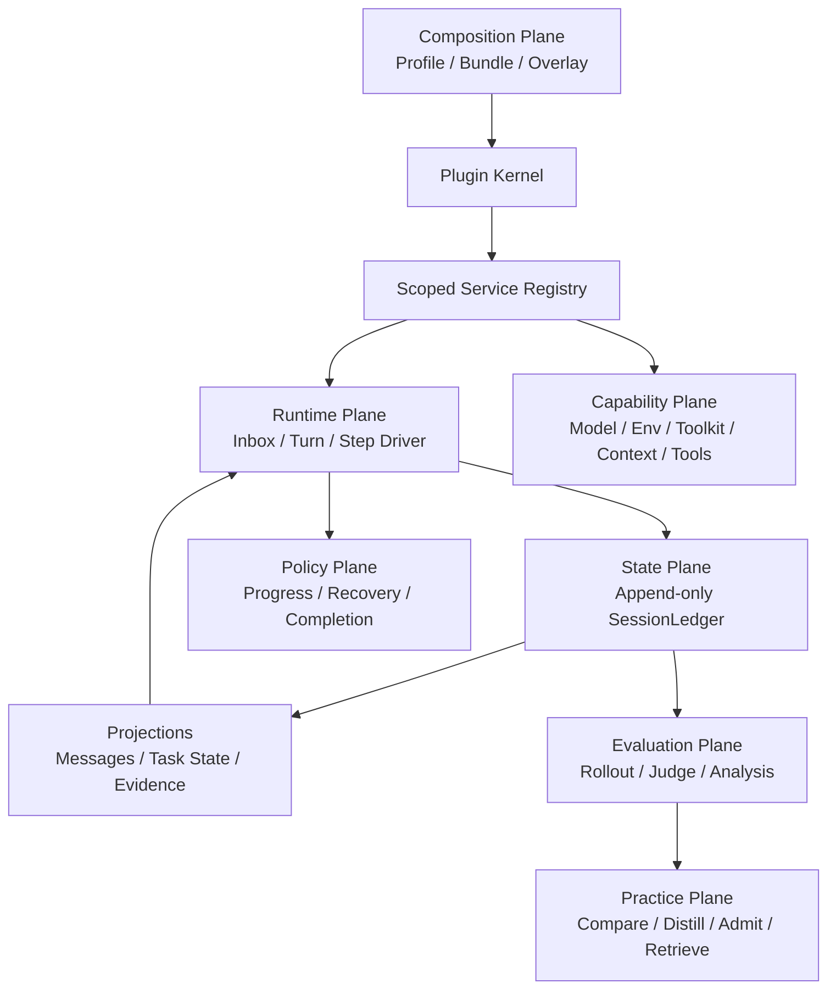

# Architecture

## Non-negotiable invariants

1. **Model-visible means ledger-backed.** Model messages are derived from the
   append-only ledger; no hidden side channel may change a request.
2. **Capabilities are services.** Consumers depend on a `ServiceKey`, not a
   concrete provider.
3. **Every registration is reversible.** Plugin teardown removes services and
   listeners in reverse order.
4. **Turn and Step differ.** A Turn may contain several model/tool Steps.
5. **Runtime and evaluation are separate.** Verifiers/rewards never enter the
   online runtime state.
6. **Learning is offline and admissibility-gated.** Experience never stores a
   benchmark task id, selector, verifier wording, or expected answer.

## Planes

## Reference mapping

| Reference | Adopt | Do not copy |
|---|---|---|
| DeepSeek Harness | plugin tree, service keys, reversible effects, scoped seams, event-sourced session, Turn/Step, waterfall interception | TypeScript/Cordis runtime and full product package graph |
| Youtu-Agent | Agent factory, Environment lifecycle, Toolkit grouping, ContextManager, TaskRecorder, rollout/judgement/practice separation | default multi-agent orchestration and ground-truth-fed online learning |
| DeerFlow | sandbox, model/tool adapters, browser and MCP runtime | treating middleware order as the project architecture |
| RealReplicaBench | task isolation, artifacts, verifier and held-out evaluation | verifier data in the online runtime |

## Migration stages

1. Kernel, ledger, capability contracts, synthetic driver (implemented).
2. DeerFlow adapter writes canonical events, snapshots request inputs, owns
   environment lifecycle, and recovers partial streams (implemented).
3. TaskContract/TaskState are typed ledger facts and disposable projections;
   runtime request context is derived from a bounded projection (implemented).
4. Tool reliability and evidence completion policies attach through
   independently switchable config/service seams (implemented).
5. Evaluation pins MiniBench16 by task-order hash and emits controlled paired
   manifests. Offline preflight and a public-client same-thread policy bridge
   are implemented; paid execution stays blocked until that bridge is wired and
   verified inside the pinned DeerFlow container. Experience remains disabled
   until the leakage/admissibility gate passes.
