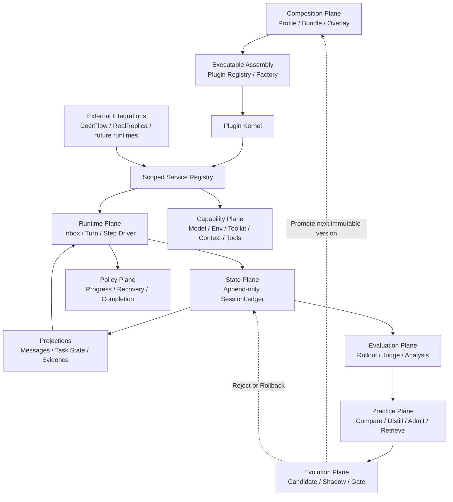

# Architecture

## Non-negotiable invariants

1. **Model-visible means ledger-backed.** Model messages are derived from the
   append-only ledger; no hidden side channel may change a request.
2. **Capabilities are services.** Consumers depend on a `ServiceKey`, not a
   concrete provider.
3. **Every registration is reversible.** Plugin teardown removes services and
   listeners in reverse order.
4. **Turn and Step differ.** A Turn may contain several model/tool Steps.
5. **Runtime and evaluation are separate.** Verifiers/rewards never enter the
   online runtime state.
6. **Learning is offline and admissibility-gated.** Experience never stores a
   benchmark task id, selector, verifier wording, or expected answer.
7. **Core is environment-agnostic.** Task ontologies and external protocols
   enter through integration extractors/providers, never through Core rules.
8. **Profiles are immutable at runtime.** Evolution creates a new version in
   Shadow; only an evidence-gated control-plane decision can promote it.
9. **Context is selected, not accumulated.** Immutable instructions and tool
   protocol groups survive; untrusted runtime facts never gain system authority.

## Planes



## Reference mapping

| Reference | Adopt | Do not copy |
|---|---|---|
| DeepSeek Harness | plugin tree, service keys, reversible effects, scoped seams, event-sourced session, Turn/Step, waterfall interception | TypeScript/Cordis runtime and full product package graph |
| Youtu-Agent | Agent factory, Environment lifecycle, Toolkit grouping, ContextManager, TaskRecorder, rollout/judgement/practice separation | default multi-agent orchestration and ground-truth-fed online learning |
| DeerFlow | sandbox, model/tool adapters, browser and MCP runtime | treating middleware order as the project architecture |
| RealReplicaBench | task isolation, artifacts, verifier and held-out evaluation | verifier data in the online runtime |

## Migration stages

1. Kernel, ledger, capability contracts, synthetic driver (implemented).
2. DeerFlow adapter writes canonical events, snapshots request inputs, owns
   environment lifecycle, and recovers partial streams (implemented).
3. TaskContract/TaskState are typed ledger facts and disposable projections;
   runtime request context is derived from a bounded projection (implemented).
4. Tool reliability and evidence completion policies attach through
   independently switchable config/service seams (implemented).
5. Evaluation pins MiniBench16 by task-order hash and emits controlled paired
   manifests. Offline preflight and a public-client same-thread policy bridge
   are implemented. A network-disabled pinned-container probe verifies the real
   embedded-client code path, and the RealReplica candidate runner now invokes
   that path behind an explicit switch while preserving baseline behavior.
   Experience remains disabled until the leakage/admissibility gate passes.
6. Core/benchmark boundaries are enforced in tests. Generic Contract parsing
   exposes `CriterionExtractor`; RealReplica owns its state vocabulary and
   Gmail/Docs/Workbench protocols. The Evolution Plane now versions Profiles,
   consumes paired Shadow evidence, and records Promote/Reject/Rollback in the
   append-only Ledger (implemented).
7. Task-aware Context compiles five scored layers under a Profile budget,
   preserves tool-call/result atomicity, emits content-free selection audits,
   and has an optional DeerFlow model-call adapter (implemented, Shadow only).
8. Executable Assembly resolves every composed PluginSpec through a closed
   registry, mounts it with Profile config, and reverses partial effects on any
   failure. Profile fingerprints reject credential-bearing configuration.
9. Profile Promotion and Experience Promotion are separate append-only
   lifecycles. Structured Experiences require three Development sources and
   two disjoint Transfer tasks before promotion; runtime retrieval is read-only.
10. Fake and DeerFlow execution now share a runtime-independent request/result
    contract and one Core-owned Policy Session. DeerFlow retains only transport,
    event translation and Observation Provider responsibilities.
11. Canonical Ledgers can become Development Rollouts only through a trusted
    partition allowlist and fail-closed evaluation-data sanitizer. Model-backed
    distillation is disabled by default; deterministic offline E2E uses no model.

## Primary model route

The active Profile uses `deepseek-v4-flash-vision-exp` as one multimodal Primary
Model for language and image inputs. Vision-required tasks reuse the same
provider, base URL and credential route by default. A separate vision provider
is a legacy Runtime Adapter override, not part of the active experiment design.

## Core and integration boundary

`RuleBasedTaskContractBuilder` understands only portable concepts: public
artifacts, explicit global counts and a sanitized public schema. An integration
may inject `CriterionExtractor` instances, but Core still assigns identifiers,
validates parameters/dependencies and rejects evaluation-only fields. This
prevents a benchmark-specific prompt phrase from becoming a permanent Harness
primitive.

The generic DeerFlow bridge similarly owns provider composition and lifecycle,
not Gmail, Google Docs or Workbench semantics. Those providers live beside the
RealReplica adapter. A source-boundary regression test rejects reintroduction
of these subjects or protocols into `task_contract.py` or
`deerflow_policy.py`.

## Governed Evolution Plane

Evolution is a control-plane workflow, not an online model action:

```text
active immutable Profile
  -> evidence-backed candidate (parent fingerprint + hypothesis)
  -> paired Shadow evaluation
  -> integrity + leakage + sample + quality-CI + stable-pass + no-progress gate
  -> Promote | Keep Shadow | Reject
  -> optional deterministic Rollback to a known non-rejected version
```

Candidate creation, Shadow evaluation, promotion, rejection and rollback are
append-only events. `EvolutionProjector` reconstructs the active version and
all statuses from JSONL. The online driver has no method that edits a Profile;
therefore a task trajectory cannot self-promote. Default Profile gates require
at least five matched pairs, a non-negative quality lower bound, no Stable-pass
Regression, and successful integrity and leakage checks. Token, tool, latency
and visual-call costs remain recorded diagnostics; fixed token growth does not
reject an otherwise successful Candidate. Resource enforcement is based on
consecutive No-progress Events and runaway repetition instead.

Experience evolution is independent of Profile evolution:

```text
Development Rollout groups
  -> Candidate Experience with structured Trigger / Strategy / Progress / Stop
  -> leakage + generalisation + exact-content deduplication
  -> Shadow transfer validation on >=2 tasks disjoint from >=3 source tasks
  -> Promote | Keep Shadow | Quarantine | Retire
  -> retrieve <=3 promoted Experiences by state + failure + runtime surface
  -> record adoption / progress / success / harm for later offline decisions
```

Source task identifiers remain provenance in the control plane and are never
rendered into the model working set. Retrieval cannot alter lifecycle state.

## Task-aware Context

The model sees a decision working set rather than unbounded conversation history:

```text
Immutable Task (20%) | Active State (30%) | Evidence (25%)
Failure / Recovery (15%) | admissible Experience (10%)
```

Ratios and total budget belong to the immutable Profile. Selection scores goal
relevance, recency, state/failure importance and evidence value. Repeated
evidence is deduplicated by semantic subject; assistant tool calls and matching
tool results are selected or dropped atomically. When a large result is dropped,
the working set retains a secret-redacted interaction fact: execution arguments,
attempt count, result hash/size, bounded preview and retention guidance.

Static authority and dynamic data use separate roles. A fixed System message
states that the named working-set Human message is untrusted data; tool/user
content is never promoted into system authority. `context/selected` records
budget, selected IDs, drop counts and a surface hash without copying content.

Historical zero-model replay over 4 runs/99 complete snapshots estimates a
49.95% median per-run reduction of the message surface; this is not an actual
provider Token measurement. Two one-task Development Shadows then falsified
premature optimism: v1 lost tool facts and failed, while v1.1 passed at 1.0 but
used 320,936 Tokens (+111.1% versus an earlier non-paired Vanilla control) and
32 tool calls. Both are rejected. Repeat-aware v1.2 recovered the identical
output with 166,070 Tokens (+9.23%) and 16 tool calls, but remains Shadow:
there is only one non-fresh-pair sample, and tool/latency costs remain high.

## Tool Action Ledger and Verification Budget

Raw call count cannot distinguish useful work from repeated observation. The
Action Ledger projects each completed call into:

```text
Intent + Resources + Data fields + argument fingerprint
Result identity + mutation epoch + verification decision
```

Intent is generic (`discover/read/search/transform/write/verify/present/unknown`)
and never keyed by benchmark task id. Natural-language `description/reason`
does not alter execution identity; credential-shaped argument keys are recorded
only as redacted key names. A successful mutation starts a new epoch and resets
the verification window. Repeated same-scope verification or more than four
checks without mutation emits a warning fact, while writes remain allowed.

The DeerFlow adapter binds action audits into the SessionLedger. Its middleware
is currently `observe` only: no ToolMessage is modified and no call is blocked.
Across 7 historical/candidate runs it projected 200 actions into 145 clusters,
classified 80.5%, and found 22 budget warnings. Two stable-pass controls had
zero warnings; two historical failures had 16. With 39 unknown actions and only
two success controls, enforcement is explicitly not ready. Profile v1.3 has a
network-disabled container probe and MiniBench preflight but zero paid runs.

P20 adds explicit browser navigation/observation/interaction semantics and API
mutation handling. Classification reaches 100% on the same 200 actions; five
deterministic browser controls plus two stable-pass controls remain unwarned,
while both historical failure controls are signaled. Wilson bounds qualify only
non-blocking Advice (false-warning upper 0.354, failure-signal lower 0.342), not
enforcement.

Paid single-task Shadows again prevent optimistic claims. v1.4 Advice fired once
at the final verification, too late to reduce work, and was rejected at 189,696
Tokens/23 tools. v1.5 targets the fourth unchanged read and returned the same
2,120 semantic rows at 154,036 Tokens (+1.31% versus an older non-paired
Vanilla control), but used 16 tools, took 83.5 seconds, and fired zero Advice.
It remains Shadow because the directional improvement is not attributable to
the policy and tool/latency/sample gates remain open.

## Evaluation stop rule

A paired cell must pass integrity, quality, semantic-output and Ledger-evidence
gates. Token, tool-call and latency deltas are always reported, but do not form
a fixed-ratio stop gate. The first live pair historically stopped under the
superseded +25% token policy; its evidence remains immutable and must not be
relabelled as a new-policy result. A new run may continue only when Ledger
evidence shows no uncontrolled No-progress loop.

MiniBench16 is a frozen, stratified subset of the official Development pool.
It has internal roles of 8 Development, 4 Transfer Validation and 4 Held-out
Evaluation tasks. These project roles prevent Experience leakage; they do not
claim to replace RealReplicaBench's official Held-out split. Paid execution is
staged by role, and a final Candidate is the only configuration allowed to use
the internal Held-out partition.

## First live Runtime Evolution result

The first paid primary-model Development cell falsified the assumption that
same-scope Advice alone bounded cost: v2 reached 1.82M observed Tokens and 176
tool calls. Successive generic controls added atomic pre-handler admission,
model-batch termination, and output-write-verified delivery recovery. The best
measured candidate, v2.6, moved public capacity from 0.0 to 0.4 and used 11.1%
fewer observed Tokens than Vanilla, but still failed the task and increased
tool calls from 18 to 42. It is therefore Shadow evidence, not a promoted
success, and no Transfer or Held-out execution is authorized.

## Evidence Workspace v3

The next candidate fixes the architecture exposed by that failed run rather
than encoding task answers. Tool observations are compiled into typed,
content-addressed resource blocks with access counts, safe excerpts, and an
explicit archive dashboard. Durable failures, completion results, recovery,
and a soft evidence-derived phase are bound into the actual DeerFlow model
request. Public task prompts can add JSON shape/identity checks and successful
source-access obligations without reading evaluator-private data. Tool ledgers
and delivery state now live for the task run, while admission budgets remain
turn-scoped. A shared redaction module protects raw history, Action Ledger
previews, workspace blocks, and safe fallback context.

This remains a Shadow candidate. Historical replay proves that the old v2.6
artifact would be rejected by public consistency checks and that critical
observations survive a 4096-token context selection. Container conformance and
the paid-canary gate use matching source/Profile fingerprints and zero model
calls. They authorize one Development canary, not Transfer, Held-out, further
tasks, or a benchmark-wide uplift claim.

That v3 canary falsified the assumption that visibility alone changes action
choice: it retained failure/phase context but still produced 46 tool calls,
350,771 Tokens, and no artifact. The remaining loop used relative paths,
case variants, and differently batched shell reads to evade exact-scope
blocking. v3.1 therefore makes source acquisition the initial phase when the
public contract declares source obligations, exposes their public URLs in
phase/recovery feedback, canonicalizes local resource aliases, applies a
task-run resource read budget across tools and turns, and reserves a third
turn for the source → artifact → validation progression. This replacement is
also single-canary-only.

The v3.1 canary then reduced Tokens and latency but still ignored explicit
source URLs. v3.2 treats safe, model-visible loopback GET obligations as a
deterministic evidence-acquisition workflow: before the first model turn it
materializes bounded, redacted public payload evidence, rejects external
redirects and credentials, and lets the phase projection start at synthesis
when source evidence is already present. A second cache-budget block ends the
current turn instead of paying for more equivalent calls. These controls remain
Profile-fingerprinted, container-probed, and single-canary-only.

Later Context Shadows are separate Profile versions and are not merged with
that pair. A reused historical Vanilla result is exploratory only. Context v1.1
remains rejected historical evidence because the run used the superseded cost
policy and only one Development task. v1.2 also stays Shadow: one exploratory
success cannot satisfy the five-sample promotion gate, especially with +7 tool
calls, +76.8% elapsed time, and no causal policy activation.

## Capability-negotiated completion

Contract parsing and criterion enforcement are distinct. Each observation
provider declares which criterion kinds/subjects it can prove. Unsupported
criteria stay in the Ledger and model context as observe-only facts; they do
not block completion until a provider exists. Historical MiniBench replay shows
5/10 failed runs blocked and 0/6 successful runs falsely blocked. Accepted
failures are content/constraint errors beyond an artifact/state completion
gate, not silent claims of full task correctness.

MCP state providers use only read-only public tools on loopback endpoints.
Gmail label/calendar existence and Google Docs pre/post content hashes raise
task-level provider coverage to 16/16. Unsupported Gmail draft verification
remains observe-only; task coverage must never be presented as every-criterion
coverage.

Completion also distinguishes a structurally valid deliverable from a vacuous
scaffold. When a public prompt uses strong completeness language (for example,
“all matching”) and its single public JSON example contains non-empty
collections, the contract stores only those collection paths—not example
values—and rejects an artifact whose entire completeness-scoped collection set
is empty. Explicit public language allowing an empty result disables this
constraint. This is a conservative public-input heuristic, not a substitute
for the benchmark verifier or hidden expected content.

Response completion is a separate conjunct. A non-empty string is insufficient
when it is a recognized runtime control envelope such as a tool-call limit or
runtime failure. This prevents an otherwise shape-valid artifact from hiding a
terminated model loop. Conversely, delivery recovery admits direct execution
of a task-provided Python transform so the model can synthesize before writing;
plain rereads remain blocked, and the directive explicitly forbids knowingly
empty placeholders used only to unlock inspection.

Tool result success follows the same rule. Stable text envelopes beginning with
`Error:`, a traceback, permission denial, or shell launch failure are recorded
as tool errors even when an upstream wrapper omitted a structured status. They
cannot advance the mutation epoch or reset no-progress budgets.

## Source-grounded synthesis and lineage

Artifact validity and semantic provenance are separate decisions. The
Source Grounding module represents public evidence as hash-only
`SourceHandle`s with explicit roles (`authoritative`, `provisional`,
`reference`, `model_prose`), decomposes output support into `ClaimAtom`s, and
records an `ArtifactDerivation` in a replayable `LineageGraph`. Its gate rejects
unknown handles, model prose used as authority, insufficient authoritative
coverage, and direct copies whose source was not declared final-eligible.

The first runtime integration is deliberately narrower than the full claim
graph: when the public task says an intermediate/draft is not truth and must be
revalidated against raw sources, the Contract derives an
`artifact.grounding:*` obligation. The filesystem provider hashes a bounded
public workspace (maximum 512 non-hidden, non-symlink files of at most 2 MiB)
and rejects a byte-identical output copy. It never reads evaluator files,
stores source contents, or assumes benchmark-specific field values. Explicit
copy/conversion tasks without the revalidation warning do not receive this
guard, preserving legitimate reuse.

Grounding failures retain bounded public diagnostics in completion feedback
and route to `SYNTHESIS_LINEAGE_GAP` recovery (`validate_contract + replan`),
not another placeholder write. This follows the separation in WebGPT,
Attributed QA, RARR, process supervision, and Chain-of-Verification: evidence
collection, claim attribution, synthesis, and final verification are distinct
runtime stages. The next extension is authoritative source-coverage handles;
the current exact-copy guard must not be presented as complete factual
verification.

## Recovery separation

Transient provider failures belong to bounded ToolRuntime retries. Semantic or
task-level failures never enter that retry loop: a separate replaceable service
chooses at most three state refresh, tool switch, contract validation, replan,
or partial-delivery actions. This mirrors the DeepSeek Harness capability seam
and Youtu-Agent policy/environment separation while preventing retry storms.

Every recovery decision is appended before continuation and later budgets are
derived from the Ledger projection. No mutable retry counter is authoritative.
When all proposed actions are exhausted, the bridge terminates before its
maximum turn count rather than issuing another model call.

Artifact delivery has two bounded lifecycle transitions rather than one sticky
boolean. A missing artifact receives one `ARTIFACT_ERROR → WRITE_PARTIAL`
attempt. If the artifact then exists but an artifact-derived public observation
(for example shape or non-vacuity) is explicitly unsatisfied, it receives one
independent `ARTIFACT_INVALID → REPAIR_ARTIFACT` attempt. DeerFlow gates these
attempts by the generation count of user-side delivery directives; tool error
messages cannot manufacture a new generation. A valid output write satisfies
only the currently observed generation, so a later failed validation re-arms
delivery without reopening an unbounded retry loop.

Execution remains deliberately split: `RecoveryExecutor` applies auditable
Harness control-state deltas and next-turn directives, while external browser,
API, and file mutations remain ordinary tools. This prevents a control policy
from fabricating world-state success.

## Semantic progress

Progress snapshots hash task Evidence and non-control state only. Repeating the
same missing artifact with a new event id is no progress; changing it to an
existing artifact is progress. Tool-call volume and `recovery.*` flags are
excluded. The durable `progress/checked` result feeds the next RecoveryContext.

Recovery outcome attribution is delayed one turn. An executed action remains
pending until a later progress/completion fact exists, then a durable outcome
links back to its execution sequence. This prevents action execution, message
volume, or tool activity from being misreported as recovery effectiveness.

Recovery Practice is offline and confidence-gated. Multi-action outcomes are
confounded and cannot promote individual actions. Promotion requires five
isolated samples, 60% observed effectiveness, and a Wilson 95% lower bound of
0.30. With zero real outcomes the correct runtime state is Practice disabled.

Mid-turn guards follow the same evidence discipline. A browser shell/CDP
fallback candidate has strong failure coverage but no successful-browser
controls, so it remains an offline, disabled Profile candidate. Failure-only
coverage cannot justify production interception.

Count criteria require explicit global semantics and a structural provider.
Per-input and enum wording is rejected by the parser; visible output-file count
is supported. This favors missing a heuristic over enforcing a false contract.

Browser-only services can expose postconditions through public materialized
outputs. The workbench calendar provider reads `created_events` and applies the
public contains-any title rule; it never bypasses the UI through backend APIs.
