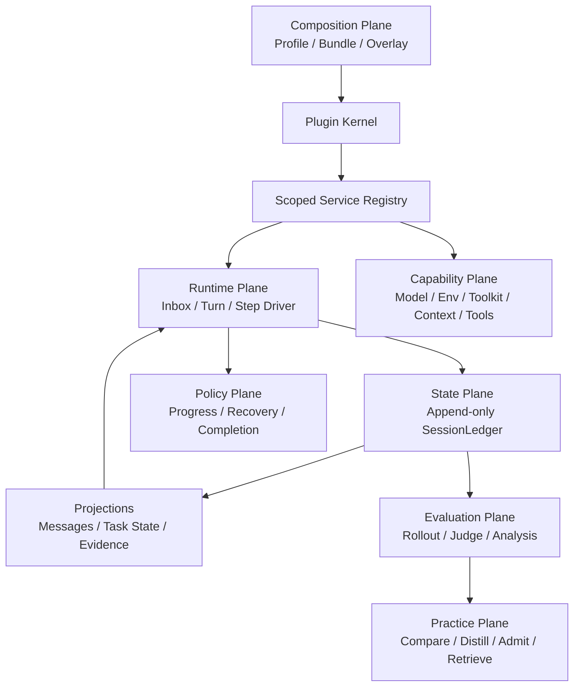

# Architecture

## Non-negotiable invariants

1. **Model-visible means ledger-backed.** Model messages are derived from the
   append-only ledger; no hidden side channel may change a request.
2. **Capabilities are services.** Consumers depend on a `ServiceKey`, not a
   concrete provider.
3. **Every registration is reversible.** Plugin teardown removes services and
   listeners in reverse order.
4. **Turn and Step differ.** A Turn may contain several model/tool Steps.
5. **Runtime and evaluation are separate.** Verifiers/rewards never enter the
   online runtime state.
6. **Learning is offline and admissibility-gated.** Experience never stores a
   benchmark task id, selector, verifier wording, or expected answer.

## Planes

## Reference mapping

| Reference | Adopt | Do not copy |
|---|---|---|
| DeepSeek Harness | plugin tree, service keys, reversible effects, scoped seams, event-sourced session, Turn/Step, waterfall interception | TypeScript/Cordis runtime and full product package graph |
| Youtu-Agent | Agent factory, Environment lifecycle, Toolkit grouping, ContextManager, TaskRecorder, rollout/judgement/practice separation | default multi-agent orchestration and ground-truth-fed online learning |
| DeerFlow | sandbox, model/tool adapters, browser and MCP runtime | treating middleware order as the project architecture |
| RealReplicaBench | task isolation, artifacts, verifier and held-out evaluation | verifier data in the online runtime |

## Migration stages

1. Kernel, ledger, capability contracts, synthetic driver (implemented).
2. DeerFlow adapter writes canonical events, snapshots request inputs, owns
   environment lifecycle, and recovers partial streams (implemented).
3. TaskContract/TaskState are typed ledger facts and disposable projections;
   runtime request context is derived from a bounded projection (implemented).
4. Tool reliability and evidence completion policies attach through
   independently switchable config/service seams (implemented).
5. Evaluation pins MiniBench16 by task-order hash and emits controlled paired
   manifests. Offline preflight and a public-client same-thread policy bridge
   are implemented. A network-disabled pinned-container probe verifies the real
   embedded-client code path, and the RealReplica candidate runner now invokes
   that path behind an explicit switch while preserving baseline behavior.
   Experience remains disabled until the leakage/admissibility gate passes.

## Evaluation stop rule

A paired cell must pass integrity, quality, semantic-output, Ledger-evidence,
and token-cost gates. The first live pair exceeded the observed-run limit
(+65.6% tokens versus +25%), so later Block 1 cells remain stopped. Its exact
model-visible surface, one-turn execution, and exact counterfactual replay show
zero attributable Harness model-token overhead for that cell. Historical
vanilla token CV is 22.4%; the stop now means “insufficient variance confidence,”
not “proven candidate cost regression.”

## Capability-negotiated completion

Contract parsing and criterion enforcement are distinct. Each observation
provider declares which criterion kinds/subjects it can prove. Unsupported
criteria stay in the Ledger and model context as observe-only facts; they do
not block completion until a provider exists. Historical MiniBench replay shows
5/10 failed runs blocked and 0/6 successful runs falsely blocked. Accepted
failures are content/constraint errors beyond an artifact/state completion
gate, not silent claims of full task correctness.

MCP state providers use only read-only public tools on loopback endpoints.
Gmail label/calendar existence and Google Docs pre/post content hashes raise
task-level provider coverage to 16/16. Unsupported Gmail draft verification
remains observe-only; task coverage must never be presented as every-criterion
coverage.

## Recovery separation

Transient provider failures belong to bounded ToolRuntime retries. Semantic or
task-level failures never enter that retry loop: a separate replaceable service
chooses at most three state refresh, tool switch, contract validation, replan,
or partial-delivery actions. This mirrors the DeepSeek Harness capability seam
and Youtu-Agent policy/environment separation while preventing retry storms.

Every recovery decision is appended before continuation and later budgets are
derived from the Ledger projection. No mutable retry counter is authoritative.
When all proposed actions are exhausted, the bridge terminates before its
maximum turn count rather than issuing another model call.

Execution remains deliberately split: `RecoveryExecutor` applies auditable
Harness control-state deltas and next-turn directives, while external browser,
API, and file mutations remain ordinary tools. This prevents a control policy
from fabricating world-state success.

## Semantic progress

Progress snapshots hash task Evidence and non-control state only. Repeating the
same missing artifact with a new event id is no progress; changing it to an
existing artifact is progress. Tool-call volume and `recovery.*` flags are
excluded. The durable `progress/checked` result feeds the next RecoveryContext.

Recovery outcome attribution is delayed one turn. An executed action remains
pending until a later progress/completion fact exists, then a durable outcome
links back to its execution sequence. This prevents action execution, message
volume, or tool activity from being misreported as recovery effectiveness.

Recovery Practice is offline and confidence-gated. Multi-action outcomes are
confounded and cannot promote individual actions. Promotion requires five
isolated samples, 60% observed effectiveness, and a Wilson 95% lower bound of
0.30. With zero real outcomes the correct runtime state is Practice disabled.
