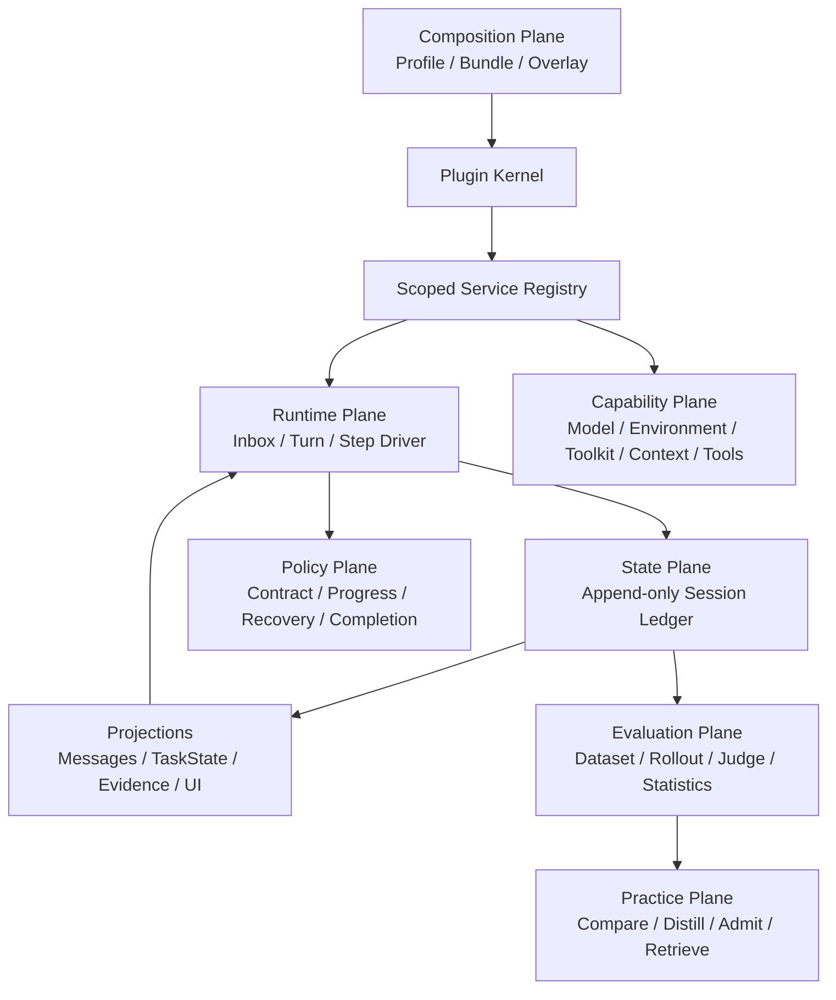
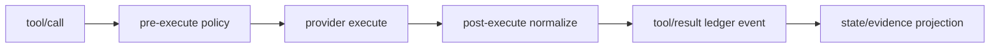
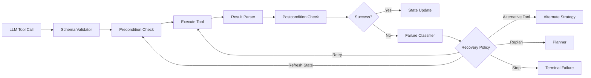
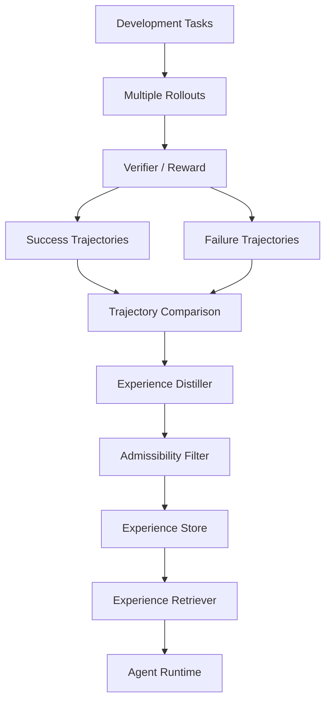

# Adaptive Agent Harness for Real-World Business Tasks

> 项目暂名：`adaptive-agent-harness`
> 项目定位：面向真实业务长链路任务的自适应 Agent Harness
> 目标 Benchmark：RealReplicaBench
> 设计基线：DeerFlow 2.0 + DeepSeek Harness + Youtu-Agent（借鉴但不限于以上项目）
> 文档版本：v0.2（Architecture-First）
> 日期：2026-08-19
> 状态：A0–A4、首个 paired canary 与全 MiniBench16 completion counterfactual 已完成；provider-aware Gate 在历史数据上捕获 5/10 failure、成功任务误拦截 0/6，扩跑仍因 Token variance 置信度不足暂停

---

## 1. 项目概述

本项目计划实现一个面向真实业务长链路任务的 **Adaptive Agent Harness**，重点研究和优化 Agent 在浏览器、CLI、文件、API/MCP 等真实业务操作场景中的任务执行可靠性。

项目不以“从零重新实现一个完整 Agent Framework”为目标，也不以简单拼接 DeerFlow、DeepSeek Harness、Youtu-Agent 为目标，而是：

1. 选择 **DeerFlow 2.0** 作为第一阶段主要 Runtime；
2. 借鉴 **DeepSeek Harness** 的插件化、事件化、可替换能力接口设计；
3. 借鉴 **Youtu-Agent** 的 rollout、trajectory comparison、experience distillation 与 Training-Free Learning 思路；
4. 自主实现任务状态管理、工具可靠性、失败恢复、上下文工程、完成条件校验、经验学习等核心模块；
5. 将新的 Agent Runtime 接入 **RealReplicaBench**；
6. 在固定模型、固定任务、固定 verifier 条件下，通过可复现的消融实验验证 Harness 对任务成功率的提升。

项目最终希望回答的问题不是：

> “哪个大模型更强？”

而是：

> **“在基础模型保持不变时，通过 Agent Harness 的系统工程优化，能够将真实业务任务成功率提升多少？哪些机制真正有效？”**

---

# 2. 项目设计出发点

## 2.1 Agent 能力不等于 LLM 能力

在真实任务中，最终成功率并不只由模型本身决定。

一个长链路业务任务通常需要：

```text
理解目标
→ 识别约束
→ 拆解任务
→ 选择工具
→ 构造参数
→ 执行工具
→ 观察环境
→ 判断进度
→ 处理失败
→ 调整计划
→ 验证结果
→ 生成最终产物
```

因此最终表现更接近：

\[
AgentPerformance =
f(
LLM,
Planning,
Context,
Tools,
StateTracking,
Recovery,
Memory,
Verification,
Runtime
)
\]

RealReplicaBench 将 Benchmark 和 Agent Harness 分离，并使用不同 Harness 执行相同任务，这使它非常适合研究 **Harness Engineering 对固定模型的增益**。

---

## 2.2 当前 Agent 的核心瓶颈不是“不会回答”，而是“不会稳定完成”

普通聊天模型最关注最终回答质量，而真实业务 Agent 更容易在执行链中失败。

典型失败模式包括：

- 漏掉任务中的约束条件；
- 任务拆解不完整；
- 工具选择错误；
- Tool Call 参数错误；
- Browser grounding 失败；
- 工具失败后无脑重复调用；
- 中间状态已经变化，但 Agent 仍基于旧状态行动；
- 长上下文导致关键目标被遗忘；
- 做到一半误判为已经完成；
- 最终文件/产物存在，但不满足交付要求；
- Agent 陷入重复 Action / Observation 循环；
- 同一种失败在不同任务中反复发生，但系统没有积累经验。

本项目的核心设计原则是：

> **不优先堆更多 Agent，而是先让单个 Lead Agent 的 Harness 更可靠。**

---

## 2.3 项目采用 Evaluation-Driven Engineering

本项目不先凭直觉堆功能，而采用以下流程：

```text
Baseline
↓
Trajectory Collection
↓
Failure Taxonomy
↓
找出 TOP Failure Modes
↓
针对性实现 Harness Module
↓
A/B Test
↓
Ablation Study
↓
保留有效模块 / 删除无效复杂度
```

每个新增模块都必须回答两个问题：

1. 它解决哪类可观测失败？
2. 它是否在固定模型条件下带来稳定 benchmark 增益？

---

# 3. 项目目标

## 3.1 核心目标

### G1. 提升任务成功率

主指标：

- RealReplicaBench `Pass Rate`

辅助指标：

- Avg. Capacity
- Failure Category Distribution
- Recovery Success Rate
- Premature Termination Rate
- Loop / Stuck Rate

---

### G2. 固定模型，测量 Harness 本身的贡献

实验必须尽量固定：

- Model
- Model Version
- Provider
- Reasoning / Thinking Setting
- Temperature
- Max Tokens
- Vision Model
- Judge Model
- Benchmark Tasks
- Verifier
- Sandbox / Runtime Image

尽量避免出现：

```text
Baseline + 弱模型
vs
改进 Harness + 强模型
```

这种无法归因的实验。

---

### G3. 建立可解释的 Agent Failure Taxonomy

不只报告：

```text
44.9% → 53.3%
```

还要回答：

```text
为什么提升？
哪些任务提升？
哪些失败减少？
哪个模块贡献最大？
增加了多少 token / latency？
```

---

### G4. 建立可复现的 Agent Evaluation Pipeline

所有实验保存：

- git commit
- config
- model/provider
- task split
- prompt version
- runtime image digest
- trajectory
- tool calls
- artifacts
- verifier result
- failure labels
- token / latency telemetry

最终形成可审计的实验记录。

---

# 4. 非目标

本项目第一阶段**不做**：

1. 为了证明“自主研发”而从零重写所有 Agent 基础设施；
2. 为了效果盲目堆 Multi-Agent；
3. 第一阶段就做大规模模型 Fine-tuning；
4. 针对单个 benchmark task 编写硬编码策略；
5. 读取 verifier 后编写 task-specific prompt；
6. 将 benchmark 答案、task_id、ground truth 直接写入经验库；
7. 以修改 Benchmark 或 Verifier 的方式“提升”分数；
8. 只追求总分而忽略成本、稳定性和泛化。

---

# 5. DeerFlow 的新定位：Runtime Provider，而不是项目架构本身

DeerFlow 仍然是第一阶段最重要的执行底座，负责成熟的：

- Model / Browser / File / Shell / MCP 工具；
- Sandbox 与任务隔离；
- Tool error handling、summarization、memory、sub-agent 等现成功能；
- RealReplicaBench 容器内的实际 Agent 执行。

但 v0.2 不再把 DeerFlow Middleware Chain 直接等同于本项目架构。原因是：

1. Middleware 顺序只解决“在哪个 hook 运行”，不能天然提供稳定的 capability identity；
2. mutable message state 不是可重放的系统事实；
3. Task State、Progress、Completion、Experience 若直接互相 import，后续无法独立替换和消融；
4. 未来切换 OpenClaw、DeepSeek Harness 或自研 Runtime 时，领域模块不应重写。

因此采用：

```text
Adaptive Harness Core（独立）
        ↓ RuntimeAdapter
DeerFlow / 其他 Runtime
        ↓ BenchmarkAdapter
RealReplicaBench
```

DeerFlow 集成优先走公开 `deerflow.extensions` entry point、`MiddlewareContributor` 和 embedded `DeerFlowClient` adapter；配置式旧 Middleware 路径只用于短期原型。只有 Runtime 本身缺少必要 capability seam 时才做小范围、可消融 Patch。

# 6. 参考架构的准确借鉴边界

本节依据以下官方源码快照，而不是二手概括：

- DeepSeek Harness `99f6f02fecdb7dff40c3fbc9470f5907c29f74ca`；
- Tencent Youtu-Agent `c2caa539f4c95ae1c39ed24dc8a99cb3651e1d5d`；
- DeerFlow runtime `0debff98c1caf4a7d3047e8ef162d85a841b5c6d`。

## 6.1 DeepSeek Harness：组成内核与事件溯源

真正值得借鉴的不是“插件数量多”，而是以下系统约束：

### 1. Context 是 Service Repository

插件通过稳定的 service key 获取能力，不 import 某个具体实现。例如 Model、Tool Registry、Session、Agent Loop 都是 service；Provider 可以替换，Consumer 不变。

### 2. Plugin 注册是 Reversible Effect

工具、事件监听器、Prompt Section、Provider 都必须返回 disposer。插件卸载或 Profile 重组时按逆序撤销，不留下半注册状态。

### 3. Profile / Bundle / Overlay 负责组成

运行时不是硬编码模块列表，而是：

```text
Base Bundle
→ Runtime Bundle
→ Profile Overlay
→ One-run Experiment Overlay
```

同一模块通过 config 开关/Provider 替换进入消融，不手工改 Agent Loop。

### 4. Append-only SessionEvent 是唯一事实源

Turn、Step、User、Assistant Chunk/Message、Tool Call/Result 全部进入单调递增事件日志；LLM history、UI、trace、resume 都是 projection。核心不变量：

> Model-visible means ledger-backed.

任何进入模型请求的内容必须能从 Ledger 重建。

### 5. Turn 与 Step 分离

```text
Turn = 一次用户/系统目标推进，可能含多个 Step
Step = 一次 Model Request + 该次产生的 Tool Calls
```

Progress/Completion 应在 Turn/Step 边界挂接，而不是依赖“第 N 条 message”。

### 6. Event 有明确 dispatch semantics

- `emit`：观察事实；
- `parallel`：并发观察；
- `serial`：有顺序的决策；
- `waterfall`：around/interception，可 delegate、rewrite 或 short-circuit。

Tool pipeline 必须拆成 `pre-execute → execute → post-execute → result`，而不是一个巨大 try/except。

### 7. Capability Seam 是三角色契约

每个 seam 同时明确：

```text
Service Definition
Provider Implementation
Consumer / Tool Adapter
```

只定义 Protocol、不提供 Provider/Consumer，不算完成架构。

## 6.2 Youtu-Agent：Agent/Environment/Toolkit/Evaluation 分层

Youtu-Agent 适合借鉴的不是默认 Multi-Agent，而是工程分层：

1. **Agent Factory**：Simple / Orchestra 由 config 选择；本项目第一阶段只启用 single Lead；
2. **Environment**：`build / cleanup / get_state / get_tools`，明确 Agent 所处世界及生命周期；
3. **Toolkit**：工具按能力组装，支持 builtin / MCP / customized，并绑定 Environment；
4. **ContextManager**：在请求前根据 Environment State 注入工作上下文；
5. **TaskRecorder**：独立记录 raw result、trajectory、final output、trace id；
6. **Evaluation**：Dataset、Rollout、Judgement、Statistics 分离，支持并发但不污染 Runtime；
7. **Practice**：Rollout summary → group comparison/advantage → experience update → re-evaluation。

本项目只在离线 Evaluation Plane 使用 reward/verifier。Youtu Practice 中可读取 ground truth 的流程不能进入在线 Agent Runtime，也不能直接用于 Held-out。

## 6.3 DeerFlow / DSH / Youtu 的职责映射

| 层 | 本项目采用 | 主要参考 |
|---|---|---|
| Composition | Kernel、Service Registry、Profile/Bundle、reversible effects | DeepSeek Harness |
| Runtime | Turn/Step Driver、Inbox、Environment、Toolkit | DSH + Youtu |
| State | append-only Ledger + projection | DeepSeek Harness |
| Capability | Model/Tool/FS/Browser/Context/Storage seam | DeepSeek Harness |
| Policy | Task Contract、Progress、Recovery、Completion | 自研领域模块 |
| Adapter | DeerFlow RuntimeAdapter | DeerFlow |
| Evaluation | Dataset/Rollout/Judge/Stats | Youtu + RealReplicaBench |
| Practice | compare/distill/admit/retrieve | Youtu，延后到 V2 |

明确不做：把三个框架嵌套调用、复制 Cordis、默认 Orchestra/Multi-Agent、将 verifier reward 注入在线 Context。

# 7. v0.2 目标架构

## 7.1 六个平面



### Composition Plane

负责“系统由哪些插件组成”，不执行业务逻辑：

```python
Profile(
    bundles=(base_runtime, deerflow_adapter, vanilla_policy),
    overlays=(experiment_candidate,),
)
```

Profile 必须生成 canonical fingerprint。任何 Candidate 只能通过 PluginSpec/Provider/Config 差异表达。

### Runtime Plane

只负责确定性驱动：

```text
turn/start
→ claim input
→ step/start
→ request/header（完整可重建）
→ model
→ tool/call + tool/result
→ step/end
→ completion decision / next step
→ turn/end
```

Driver 不包含 Browser 恢复、Task Contract 或 Experience 细节。

### Capability Plane

第一批稳定 service key：

```text
model
foreign_runtime / environment
tool_runtime
context_manager
completion_policy
ledger_store
trace_sink
```

每个能力可在 Agent Scope 内覆盖 Provider，父 Scope 的注册仍可复用。

### State Plane

`SessionLedger` 是 canonical source of truth。TaskState、Message History、Evidence Index、Cost 统计都是 projector：

```text
Ledger Events → Projection(state)
```

禁止同时维护一份“真实 messages”和一份“真实 task state”。Projection 可删掉重建。

### Policy Plane

TaskContract、Progress、Recovery、Completion 都是插件/Provider：

```python
ProgressDetector.detect(previous_projection, observation)
RecoveryPolicy.decide(failure, projection, attempts)
CompletionPolicy.check(contract, projection)
```

Policy 只写事件，不直接篡改其他模块内部对象。

### Evaluation / Practice Plane

Online Runtime 只产生 rollout 和 trajectory。Host-side Evaluation 再调用 verifier/judge；Practice 只读取 Development rollouts，经过 leakage/admissibility filter 后才能生成 Experience Candidate。

## 7.2 Durable Event 与 Live Event 分离

### Durable Ledger Facts

```text
turn/start, turn/end
step/start, step/end
request/header
user/message
assistant/chunk, assistant/message
tool/call, tool/result
state/updated
evidence/added
completion/checked
run/end
```

### Live Control Events

```text
agent/pre-step        waterfall
agent/request         waterfall
tools/pre-execute     waterfall
tools/execute         waterfall
tools/post-execute    waterfall
agent/turn-stopping   serial
run/started           emit
run/stopped           emit
```

Live event 可以 rewrite/short-circuit；任何改变 model-visible surface 的结果必须再落成 Durable Event。

## 7.3 Environment / Toolkit / Context 的边界

借鉴 Youtu-Agent：

```python
class Environment(Protocol):
    async def build() -> None: ...
    async def cleanup() -> None: ...
    def state() -> Mapping: ...
    async def tools() -> Sequence[ToolDefinition]: ...

class Toolkit(Protocol):
    async def build(environment) -> None: ...
    def tools() -> Sequence[ToolDefinition]: ...

class ContextManager(Protocol):
    def prepare(messages, environment_state, task_state) -> RequestSurface: ...
```

Environment 管生命周期和世界状态；Toolkit 管相关工具集合；ContextManager 管本次模型请求所需 Working Set。三者不得互相继承或共享 mutable global。

## 7.4 Tool Reliability Pipeline



ToolResult 统一携带：`call_id/content/error_type/metadata`。Timeout、Retry、Approval、Schema Repair 是围绕 `execute` 的 Provider/Policy，不写入 Driver。

## 7.5 Runtime Adapter

```python
class RuntimeAdapter(Protocol):
    async def start(profile, task, ledger) -> RuntimeHandle: ...
    async def stream(handle) -> AsyncIterator[RuntimeEvent]: ...
    async def stop(handle) -> None: ...
```

DeerFlow Adapter 负责把 `StreamEvent` 转成 canonical ledger events；它不拥有 TaskContract、Progress 或 Evaluation。

# 8. 当前已实现的独立架构内核

新仓库：

```text
/home/ligui/workspace/Agent/adaptive-agent-harness
```

已实现：

- `Kernel` + scoped `ServiceRegistry`；
- Plugin dependency gate 与 reverse-order reversible effects；
- `EventBus` 的 emit/parallel/serial/waterfall；
- append-only `SessionLedger`、JSONL replay、message/state projection；
- `Environment / Toolkit / ContextManager / ModelAdapter / CompletionPolicy` contracts；
- guarded `ToolRuntime`；
- Turn/Step `AgentDriver`；
- exact `request/header` ledger snapshot，保证模型请求可重建；
- Profile/Bundle/Overlay canonical fingerprint；
- DeerFlow StreamEvent adapter；
- Rollout/Judge/Experience records 与 leakage admissibility filter；
- 52 个零模型架构测试。

这部分才是“Agent 架构优化”的主工程。RealReplicaBench 测试管线继续作为外部 Evaluation Adapter，不能替代架构本身。

# 9. 核心模块设计

## 9.1 Task Profiler

### 作用

在进入 Agent Loop 前，对任务进行轻量分类。

输出示例：

```json
{
  "task_type": "browser_state_change",
  "interfaces": ["browser", "file"],
  "requires_vision": true,
  "long_horizon": true,
  "requires_artifact": true,
  "estimated_steps": 12,
  "parallelizable": false
}
```

### 目的

决定：

- 是否进入显式规划模式；
- 是否启用 Sub-Agent；
- Context Budget；
- Recovery Budget；
- Browser Snapshot 策略；
- Completion Checker 类型；
- 是否需要 Artifact Verification。

---

# 10. Goal Contract：把“任务描述”转成“执行契约”

普通 Agent 往往只保留自然语言 Prompt。

本项目增加结构化 `TaskContract`。

```python
TaskContract:
    task_id: str
    original_request: str

    goal: str
    deliverables: list[Deliverable]
    constraints: list[Constraint]
    success_criteria: list[Criterion]

    subgoals: list[SubGoal]
    assumptions: list[str]

    required_interfaces: list[str]
    artifact_requirements: list[str]
```

`SubGoal`：

```python
SubGoal:
    id: str
    description: str
    status: pending | in_progress | completed | blocked

    completion_evidence: list[Evidence]
    dependencies: list[str]
    attempts: int
```

### 关键原则

**任务“完成”不能只由 LLM 自己说了算。**

每个 completed subgoal 尽量绑定 evidence：

- Browser state；
- API response；
- File hash；
- output file；
- DOM state；
- command output；
- structured tool result。

---

# 11. Progress / State Manager

这是本项目最核心的自主模块之一。

目标：

> 让 Agent 始终知道“我正在做什么、已经完成什么、还有什么没完成”。

维护：

```python
TaskState:
    contract
    current_subgoal
    completed_subgoals
    blocked_subgoals

    latest_observations
    evidence_index

    tool_failures
    recovery_history

    browser_state
    file_state
    artifact_state

    last_progress_at
```

每次 Tool Result 后生成 `StateDelta`：

```python
StateDelta:
    changed: bool
    changed_fields: list[str]
    evidence_added: list[str]
    subgoal_completed: list[str]
    new_failure: Failure | None
```

---

# 12. Progress Detector

负责判断：

> Agent 最近是否真正向目标靠近？

不能只看“是否执行了 Tool Call”。

### 可观测信号

- TaskState 是否发生变化；
- Browser URL / DOM / target element 是否变化；
- File hash 是否变化；
- Artifact 是否生成；
- Todo / Subgoal 状态是否变化；
- Tool result novelty；
- 连续相同行为次数；
- 连续相同错误次数；
- 是否新增完成证据。

### No-Progress 示例

```text
click(selector=A)
→ element not found

click(selector=A)
→ element not found

click(selector=A)
→ element not found
```

应判定：

```text
STUCK / NO_PROGRESS
```

而不是继续调用。

---

# 13. Tool Reliability Layer

目标：

> 将“LLM 直接调用工具”升级成“受控、可诊断、可恢复的工具执行”。

架构：



---

## 13.1 FailureClassifier

统一错误类型：

```python
FailureType:
    INVALID_ARGUMENT
    SCHEMA_ERROR
    NOT_FOUND
    STALE_STATE
    PERMISSION
    AUTH
    RATE_LIMIT
    TIMEOUT
    TRANSIENT
    TOOL_INTERNAL
    BROWSER_GROUNDING
    NO_PROGRESS
    CONTEXT_LOSS
    PRECONDITION_FAILED
    POSTCONDITION_FAILED
    ARTIFACT_INVALID
```

统一输出：

```python
Failure:
    type
    recoverable: bool
    source_tool
    message
    evidence
    suggested_actions
    retry_budget
```

---

## 13.2 RecoveryPolicy

禁止简单：

```text
失败 → 原样 retry
```

改成：

```text
Failure Type
↓
Failure-specific Recovery
```

例如：

### Browser Element Not Found

```text
NOT_FOUND
→ refresh snapshot
→ inspect current page
→ relocate semantic target
→ retry once
→ still fail → alternative navigation / replan
```

### Stale Element

```text
STALE_STATE
→ discard old selector
→ new DOM snapshot
→ re-ground
```

### API 400

```text
INVALID_ARGUMENT
→ parse API error
→ inspect schema
→ repair arguments
→ retry
```

### 连续无新增信息

```text
NO_PROGRESS
→ stop same-tool retry
→ summarize attempted strategies
→ replan
```

---

# 14. Completion Gate

这是另一个重点模块。

普通 Agent：

```text
LLM: “任务完成了。”
→ Final Answer
```

本项目：

```text
LLM proposes finish
↓
Completion Gate
↓
逐项检查 TaskContract
↓
是否有 Completion Evidence?
↓
artifact 是否存在？
↓
postcondition 是否成立？
↓
所有 mandatory constraints 是否满足？
```

如果失败：

```text
Completion rejected
→ Missing Criteria
→ Inject into Context
→ Continue Agent Loop
```

伪代码：

```python
if agent_wants_to_finish:
    result = completion_verifier.verify(task_state)

    if not result.passed:
        inject_missing_requirements(result.missing)
        continue_run()

    finalize()
```

目标重点降低：

- Premature Termination；
- Partial Completion；
- Missing Artifact；
- Forgotten Constraint。

---

# 15. Task-aware Context Engineering

长任务的 Context 不应只是：

```text
全部历史消息无限堆积
```

本项目将 Context 分成 5 层。

```text
1. Immutable Task Context
   - Original Task
   - Goal Contract
   - Hard Constraints

2. Active Working State
   - Current Subgoal
   - Current Plan
   - Latest State

3. Relevant Evidence
   - Important Tool Results
   - Browser / File / API Evidence

4. Episodic Failure Context
   - Failed Attempts
   - Recovery History
   - No-progress Signals

5. Retrieved Experience
   - Similar failure pattern
   - Recommended strategy
```

默认可以使用类似预算：

```text
20% Immutable Task
30% Current State + Plan
25% Recent Relevant Observations
15% Retrieved / Durable Evidence
10% Experience / Reserve
```

后续通过实验调整，而不是写死。

---

## 15.1 Context Selection Score

对候选 Context Item 计算：

\[
Score(c_i) =
\alpha GoalRelevance +
\beta Recency +
\gamma StateImportance +
\delta FailureImportance +
\epsilon EvidenceValue
\]

低价值历史进入摘要或外部存储。

### 原则

```text
Context ≠ Conversation History
Context = 当前决策所需的 Working Set
```

---

# 16. Experience Learning

## 16.1 目标

解决：

> “Agent 每次失败都像第一次失败。”

Experience 不存任务答案，而存可迁移策略。

结构：

```python
Experience:
    id: str

    trigger:
        task_features
        tool
        failure_type

    situation: str
    failure_pattern: str
    successful_strategy: str
    anti_pattern: str

    applicable_conditions: list[str]
    confidence: float

    provenance:
        development_run_ids
        source_failure_types
```

---

## 16.2 Experience Distillation

只从 **Development Set** trajectory 学习。



借鉴 Youtu-Agent：

1. trajectory summarization；
2. 同题多 rollout 比较；
3. success/failure contrast；
4. 经验抽取；
5. 经验合并 / 更新；
6. 再评估。

---

## 16.3 Experience Admissibility Filter

为了避免 Benchmark Leakage，自动拒绝：

- task_id；
- benchmark ground truth；
- verifier-specific wording；
- 单一商品名/页面名等无法泛化的任务答案；
- “遇到 task X 就执行 Y”；
- 直接保存完整成功 trajectory。

鼓励保留：

```text
When a dynamic browser form changes after input,
refresh the DOM snapshot before locating the submit control.
```

而不是：

```text
在 task browser-xxx 中点击按钮 #submit-187。
```

---

## 16.4 Experience Retrieval

第一阶段不需要复杂 Vector DB。

推荐顺序：

### V1

```text
metadata filter + SQLite FTS5/BM25
```

### V2

如果 Experience 数量明显增加：

```text
BM25
+
Embedding Retrieval
+
RRF
+
Optional Reranker
```

检索条件包含：

- Task Type；
- Interface；
- Current Tool；
- Failure Type；
- Current Subgoal；
- Error Message。

---

# 17. 内部事件与可观测性

借鉴 DeepSeek Harness 的 Event / Capability Seam 思路，内部定义统一 Event。

```python
AgentEvent:
    event_type
    run_id
    task_id
    step
    timestamp
    payload
```

核心事件：

```text
task.started
task.contract_created

plan.created
plan.updated

tool.called
tool.succeeded
tool.failed

state.updated
progress.detected
no_progress.detected

failure.classified
recovery.started
recovery.succeeded
recovery.failed

completion.checked
completion.rejected
completion.passed

experience.retrieved
experience.applied

run.completed
run.failed
```

用途：

- Trace；
- Failure Analysis；
- Dashboard；
- Ablation；
- Experience Distillation；
- Debugging。

---

# 18. 与 DeerFlow 的集成方式

## 18.1 Adapter-first，而不是继续堆 Middleware

DeerFlow 侧分两层：

1. **Runtime Adapter**：启动 `DeerFlowClient`、选择模型/工具/环境、把事件写入 canonical Ledger；
2. **Policy Bridge**：只有必须在 DeerFlow Agent 内拦截时，才通过 `deerflow.extensions` entry point 注入薄 Middleware。

领域模块依赖本项目 ServiceKey/Event/Ledger contract，不依赖 DeerFlow middleware class。

```text
adaptive_harness domain plugin
        ↓ stable service/event contract
DeerFlowPolicyBridge（薄）
        ↓
MiddlewareContributor / AgentMiddleware
```

## 18.2 事件映射

```text
DeerFlow messages-tuple(ai)   → assistant/chunk or assistant/message
DeerFlow messages-tuple(tool) → tool/result
DeerFlow values               → runtime snapshot/evidence projection input
DeerFlow end                  → runtime/end usage
```

原始事件仍保存，canonical 事件用于跨 Runtime 比较。

## 18.3 生命周期

- Environment build：容器、CDP、MCP、workspace；
- Driver run：Turn/Step；
- Environment cleanup：容器与临时状态；
- Host Evaluation：artifact collection 与 verifier；
- 两侧失败分别归类为 Runtime Failure / Benchmark Failure。

## 18.4 不变量

- DeerFlow private mutable state 不能成为唯一任务事实；
- 所有进入模型的新增 Context 必须进入 `request/header` 或 `user/message` ledger event；
- Extension 卸载必须撤销 listener/service；
- Adaptive policy 默认关闭，通过 Profile Overlay 开启；
- RealReplicaBench verifier 永不进入 DeerFlow Context。

# 19. DeepSeek Harness 思想如何落地

不直接把 DeepSeek Harness 的 Agent Loop 嵌入 DeerFlow。

而是借鉴：

```text
everything replaceable
```

为自己的能力定义 Protocol。

示例：

```python
class ProgressDetector(Protocol):
    def detect(
        self,
        previous_state: TaskState,
        current_state: TaskState,
        observation: Observation,
    ) -> ProgressResult:
        ...
```

```python
class RecoveryPolicy(Protocol):
    def decide(
        self,
        failure: Failure,
        state: TaskState,
        history: list[RecoveryAttempt],
    ) -> RecoveryDecision:
        ...
```

```python
class CompletionVerifier(Protocol):
    def verify(
        self,
        contract: TaskContract,
        state: TaskState,
    ) -> CompletionResult:
        ...
```

未来可以 A/B：

```text
RuleBasedRecovery
vs
LLMRecovery
vs
HybridRecovery
```

而无需修改 Agent Core。

---

# 20. RealReplicaBench 集成方案

RealReplicaBench 当前将 Benchmark Contract 与 Harness 分离。

本项目建议维护一个**最小 Benchmark Adapter Fork**：

```text
real_replica_bench/harnesses/adaptive_agent/
```

新增：

```text
README.md
runner.py
adapter.py
runtime_config.py
artifact_collector.py
```

并在：

```text
real_replica_bench/harnesses/registry.py
```

注册新的 harness。

---

## 20.1 Benchmark Adapter 的职责

只负责：

```text
TaskSpec
↓
启动隔离容器
↓
注入任务
↓
启动 Adaptive Agent
↓
等待完成
↓
收集 trajectory
↓
收集 artifacts
↓
交回 RealReplicaBench verifier
```

它不负责：

- 改任务；
- 改 verifier；
- 提供 task-specific hint；
- 读取 benchmark ground truth 后指导 Agent。

---

## 20.2 Benchmark Integrity

建议 CI 增加：

```text
hash(tasks/)
hash(verifiers/)
```

实验期间禁止修改。

或者：

```text
git diff upstream/main -- tasks verifiers
```

必须为空。

这样最终技术报告可以明确声明：

> Benchmark tasks and verifier logic were kept unchanged.

---

# 21. 实验设计

## 21.1 Baseline

至少设置：

### Baseline A

```text
Fixed Model + OpenClaw
```

### Baseline B

```text
Fixed Model + Vanilla DeerFlow
```

### Experiment

```text
Fixed Model + Adaptive Agent Harness
```

---

## 21.2 控制变量

固定：

```text
Model ID
Provider Endpoint
Reasoning Setting
Temperature
Max Output Tokens
Image Model
Task Timeout
Judge Model
Benchmark Version
Runtime Image
```

所有 config 入库。

---

# 22. Development / Held-out Split

RealReplicaBench 目前包含 107 个任务。

建议第一阶段做：

```text
Development Set: 70
Held-out Set:    37
```

按任务接口大致分层：

| 类型 | 总数 | Dev | Held-out |
|---|---:|---:|---:|
| CLI | 53 | 35 | 18 |
| Browser | 28 | 18 | 10 |
| File | 16 | 10 | 6 |
| API/MCP | 10 | 7 | 3 |
| **Total** | **107** | **70** | **37** |

同时尽量对：

- text-only；
- browser-text；
- vision-required；

做二次 stratification。

生成一次固定 task list：

```text
splits/dev.txt
splits/heldout.txt
splits/seed.json
```

之后冻结。

---

# 23. Benchmark Leakage 防护

所有：

- Prompt 优化；
- Recovery Rule；
- Context Policy；
- Experience Learning；
- Threshold；
- Retry Budget；

只允许使用 Development Set。

Held-out Set：

```text
不人工查看中间失败
不基于结果继续调参
最终阶段一次性运行
```

如果需要继续开发，则重新定义下一轮实验，并明确上一轮 held-out 已经失去“纯测试集”属性。

---

# 24. Failure Taxonomy

第一阶段先自动+人工标注 Failure。

建议类别：

| Category | 描述 |
|---|---|
| TASK_UNDERSTANDING | 任务/约束理解错误 |
| PLAN_INCOMPLETE | 规划缺步骤 |
| WRONG_TOOL | 工具选择错误 |
| TOOL_ARGUMENT | 参数/schema 错误 |
| BROWSER_GROUNDING | UI 元素定位错误 |
| PRECONDITION | 前置状态未满足 |
| TOOL_RUNTIME | 工具执行失败 |
| STALE_STATE | 使用过期页面/环境状态 |
| NO_PROGRESS | 连续操作没有推进 |
| LOOP | 重复 action/observation |
| CONTEXT_LOSS | 忘记关键上下文 |
| STATE_INCONSISTENCY | 对当前完成状态判断错误 |
| PREMATURE_FINISH | 过早结束 |
| ARTIFACT_ERROR | 文件/最终产物错误 |
| CONSTRAINT_MISS | 漏掉硬约束 |
| INFRA_FAILURE | API/provider/runtime 非 Agent 逻辑失败 |

---

# 25. 消融实验

最终不能只对比：

```text
Vanilla vs Full
```

建议：

| Variant | Pass Rate | Capacity | Recovery Rate | Premature Finish | Token |
|---|---:|---:|---:|---:|---:|
| Vanilla DeerFlow | - | - | - | - | - |
| + Task Contract | - | - | - | - | - |
| + Progress State | - | - | - | - | - |
| + Tool Recovery | - | - | - | - | - |
| + Completion Gate | - | - | - | - | - |
| + Context Manager | - | - | - | - | - |
| + Experience | - | - | - | - | - |
| **Full** | - | - | - | - | - |

同时按任务类型拆：

| Variant | Browser | CLI | File | API/MCP |
|---|---:|---:|---:|---:|
| Baseline | - | - | - | - |
| + Recovery | - | - | - | - |
| + Context | - | - | - | - |
| Full | - | - | - | - |

---

# 26. 指标体系

## Primary

```text
Task Pass Rate
```

---

## Secondary

```text
Avg Capacity
```

---

## Harness-specific Diagnostics

```text
Recovery Trigger Count
Recovery Success Rate
No-progress Rate
Loop Rate
Premature Completion Rate
Tool Failure Rate
Tool Repair Success Rate
Replan Count
Completion Gate Reject Count
Experience Hit Rate
Experience Useful Rate
```

---

## Cost

```text
Token Usage
Wall Time
Tool Calls
LLM Calls
```

注意：

不同 Harness 的 tool granularity 和 runtime scheduling 可能不同，因此 Steps / Time / Tokens 不应该被当作绝对标准化效率分数。

更适合：

- 同一 Harness 的 ablation；
- 趋势分析；
- 质量-成本 trade-off。

---

# 27. v0.2 代码目录

```text
adaptive-agent-harness/
├── pyproject.toml
├── README.md
├── docs/
│   └── architecture.md
├── src/adaptive_harness/
│   ├── kernel.py          # Plugin / Service Registry / reversible effects / scope
│   ├── events.py          # typed live dispatch semantics
│   ├── lifecycle.py       # pre-step/request/tool/turn seams
│   ├── ledger.py          # append-only facts + replay + projections
│   ├── capabilities.py    # Model/Env/Toolkit/Context/Completion contracts
│   ├── tool_runtime.py    # guarded tool registry/pipeline
│   ├── runtime.py         # Turn/Step driver only
│   ├── config.py          # Profile / Bundle / Overlay fingerprint
│   ├── evaluation.py      # Rollout/Judge/Experience offline records
│   └── integrations/
│       └── deerflow.py    # Runtime event adapter
└── tests/
    ├── test_kernel.py
    ├── test_events_ledger.py
    ├── test_runtime.py
    └── test_config_evaluation.py
```

后续领域插件独立放置：

```text
plugins/
├── task-contract/
├── progress-state/
├── recovery-policy/
├── completion-gate/
└── experience-practice/   # V2
```

每个 Plugin 必须声明 required/provided ServiceKey、Event、Config、Ledger Event 和 disposer。

# 28. 配置设计

采用 DeepSeek Harness 风格的 Profile / Bundle / Overlay，而不是一个不断膨胀的全局 YAML：

```yaml
profile: realreplica-vanilla
bundles:
  - base-kernel
  - deerflow-runtime
  - realreplica-observability

overlays: []
```

Candidate：

```yaml
profile: realreplica-candidate
bundles:
  - base-kernel
  - deerflow-runtime
  - realreplica-observability
overlays:
  - task-contract-v1
```

每一行是完整 `PluginSpec`：

```yaml
name: task-contract-v1
enabled: true
provider: adaptive_harness.plugins.task_contract:install
config:
  mode: rule_only
```

Profile 组成后输出 SHA-256 fingerprint；Runtime image、Model route、Prompt assembly、Tool schemas、Policy Provider 都进入 fingerprint。消融通过替换 Overlay，不改 Driver。

# 29. Architecture-first 里程碑

## A0：Independent Kernel（已完成）

- scoped Service Registry；
- Plugin lifecycle / reversible effects；
- event dispatch modes；
- append-only ledger/replay/projection；
- Environment/Toolkit/Context/Tool contracts；
- synthetic Turn/Step driver。

## A1：DeerFlow Runtime Adapter（已完成）

- 将当前 RealReplica runner 的事件转换逻辑迁入 Adapter；
- exact request/header 与 Tool schema snapshot；
- runtime/environment lifecycle；
- 与现有 M0 run bundle 做零 Token replay 等价测试。

实现证据：

- `DeerFlowClient.stream` 的结构化 Runtime bridge；
- `messages-tuple / values / end` 的幂等 canonical event 映射；
- `request/header` 记录 messages、tool schemas、runtime context 与非敏感 client options；
- Environment `build/cleanup` 以及异常时 partial ledger 恢复；
- 13 个零模型单元测试；
- 4 个历史 M0 run 离线回放全部通过 response、tool call/result count、usage exact check，新增模型调用与 Token 均为 0；
- 回放证据位于 `evidence/a1-replay/summary.json`，报告仅保存长度与 SHA-256，不保存任务响应正文。

## A2：TaskContract + TaskState Projection（已完成）

- 从公开 task prompt/schema 生成 criterion；
- Contract/State 只通过 ledger event 演化；
- 不接 verifier；
- synthetic missing-artifact / exact-count / dependency tests。

实现证据：

- `task_contract_builder` 稳定 ServiceKey，可被 Profile/Plugin 替换；
- 仅从公开 task prompt/public schema 生成 artifact、exact-count、observation、dependency criterion；
- public schema 出现 `verifier / rubric / ground_truth / expected_answer / judge` 字段时 fail closed；
- `task/contract-created`、`state/updated`、`evidence/added`、`failure/classified`、`completion/checked` 全部为 append-only durable facts；
- `TaskStateProjector` 不保留 mutable source of truth，删除后从 JSONL replay 可精确重建；
- Driver 只在 Profile 提供 builder 时启用，并把有界 TaskState working set 写入 `request/header`；完整 evidence 仍只保存在 Ledger，避免长工具输出反复消耗模型 Token；
- missing-artifact、exact-count mismatch、dependency blocked、空 criterion、循环依赖均 fail closed；
- 全量 21 个零模型测试通过，A1 四个历史回放的 canonical SHA-256 保持不变；
- 证据位于 `evidence/a2-projection/summary.json`。

## A3：Tool Reliability + Completion Policy（已完成）

- pre/execute/post/result pipeline；
- FailureClassifier 与有限 Recovery；
- Completion Gate 读取 Contract + Projection + Evidence；
- 每个模块单开关消融。

实现证据：

- `ToolRuntime` 输出完整 `ToolExecutionTrace`，保留每次 attempt、分类 failure 与 recovery decision；
- `RuleBasedFailureClassifier` 在零模型成本下区分 TIMEOUT、TRANSIENT、NOT_FOUND、INVALID_ARGUMENT、AUTHORIZATION、EXECUTION_ERROR；
- `BoundedRecoveryPolicy` 只重试 transient failure，严格受 `max_attempts` 限制，永久错误不重试；
- `ToolReliabilityConfig.enabled` 单独控制工具可靠性，关闭时保持单次执行 baseline；
- Tool provider 可返回结构化 `metadata.evidence`，Driver 将其写成 `evidence/added`；普通 Tool prose 永不自动视为完成证据；
- `TASK_COMPLETION_GATE` 为 opt-in ServiceKey：挂载时模型的 finish proposal 必须通过 Contract + Projection + Evidence，未挂载即为 clean ablation baseline；
- missing artifact 场景中，首次“done”被拒绝，结构化 artifact evidence 写入后第三步才允许完成；
- failure/recovery 在 `tool/result` 前按因果顺序写入 Ledger，异常 evidence schema fail closed；
- 全量 29 个零模型测试和 4 个 A1 历史 replay hash 兼容检查通过，新增模型调用及 Token 为 0；
- 证据位于 `evidence/a3-reliability/summary.json`。

## A4：Evaluation Adapter（离线 preflight 已完成，live paired run 未放行）

- RealReplicaBench Dataset/Rollout/Judgement/Stats；
- Baseline/Candidate paired runner；
- Failure Dataset 与 cost report。
- 最终付费测试只使用已冻结的 `RealReplicaBench/splits/minibench16.*`，不运行完整 107 任务；
- 先做 MiniBench16 contract coverage 与历史轨迹 offline preflight，再按 block 分批运行，任何 gate 失败立即停止后续 block。

当前实现与证据：

- `RealReplicaMiniBenchAdapter` 严格校验 collection/selection/blocks 三者任务顺序一致、16 个唯一任务、task-id SHA-256、seed、Dev-only 与 Heldout 不相交；
- 从公开 `task.md` 和非评测 task metadata 构造 Dataset identity，不向在线 Contract/Context 传入 rubric、verifier 或 ground truth；
- Dataset 覆盖：CLI 5 / Browser 5 / File 3 / API 3；easy 3 / medium 4 / hard 8 / unknown 1；text-only 8 / browser-text 3 / vision 5；
- 生成 32-cell baseline/candidate paired manifest，强制 model、runtime image、seed、task/block 相同，同时要求 Profile fingerprint 不同；
- paired statistics 只统计同时存在 baseline 与 candidate 的 sample，禁止 unmatched rollout 稀释或抬高结果；
- 历史 baseline 16/16 都有 integrity/formal-eligible 记录，但来自 6 种 run-config fingerprint，因此只用于失败定位，明确禁止复用为正式 paired baseline；
- public prompt contract coverage 已达到 16/16、37 个 criterion（26 artifact + 3 exact-count + 8 observation）；5 个 stateful/browser/API 任务通过 provider-neutral `observation_equals` contract 覆盖，不按 task-id 存答案；
- `DeerFlowPolicyBridge` 使用公开 embedded-client stream，在同一 thread 内执行有界 continuation：首次 finish 缺证据则落 `completion/checked`、写入反馈并继续下一 turn；
- `FileArtifactObservationProvider` 对隔离 task root 下的必需文件记录 exists/size/SHA-256；`StructuredDeerFlowObservationProvider` 只接受 Tool artifact 中显式 evidence，不解析工具 prose；
- 每个 DeerFlow turn 使用 `runtime/turn-end`，全局只落一个 `runtime/end`，多 turn usage 可重建累加；达到 turn budget 仍缺证据时 fail closed；
- public-client bridge 的零模型 same-thread、structured observation、filesystem hash、budget exhaustion 测试已通过，但尚未安装/验证到 pinned DeerFlow container，故 `live_policy_bridge_ready=false`、`paid_run_ready=false`；
- 全量 41 个零模型测试通过，A1 四个历史 replay hash 保持不变；
- preflight 新增模型调用及 Token 为 0，证据位于 `evidence/a4-minibench-preflight/summary.json`。
- bridge 证据位于 `evidence/a4-live-bridge/summary.json`。
- pinned-container probe 使用 `--network none` 临时容器，将当前 Harness 源码复制进固定镜像，执行真实 `DeerFlowClient.stream` 两轮、21 条 Ledger facts、同 thread completion continuation，模型调用为 0；镜像 ID 为 `sha256:d2eed0f7...`，证据位于 `evidence/a4-container-wiring/summary.json`；
- RealReplica commit `a07330f` 增加 `deerflow.adaptive_policy_enabled`：candidate runner 复制 Harness、启用 PolicyBridge、保存 `agent/adaptive-ledger.jsonl`，并在 candidate 模式禁用会提前杀进程的旧 poller；baseline switch-off 路径保持不变；
- 组合 probe 直接从 RealReplica runner 生成容器脚本，在 pinned image / `--network none` 下验证 exact candidate path，记录 `realreplica_candidate_runner_wired=true`、0 模型调用，preflight 五项 gate 全部通过；

## A5：Practice（V2）

- success/failure group comparison；
- experience candidate；
- admissibility/leakage filter；
- retrieval-off 对照；
- 未过门禁默认不加载。

# 30. MVP 范围

如果时间有限，优先完成：

```text
RealReplicaBench Adapter
+
Task Contract
+
Progress State
+
Tool Recovery
+
Completion Gate
+
Failure Analysis
+
Ablation
```

这 6 个部分已经足以成为一个完整、高质量的 AI 应用研发项目。

Experience Learning 可以作为 V2。

---

# 31. 测试策略

## Unit Test

重点：

```text
FailureClassifier
RecoveryPolicy
Context Budget
Completion Gate
TaskState Transition
Experience Leakage Filter
```

---

## Integration Test

构造小型 synthetic task：

```text
browser form
API error
CLI retry
file artifact
stale state
loop
```

验证 recovery 是否真的工作。

---

## Regression Test

每次修改后固定运行一组：

```text
10~15 Representative Tasks
```

避免：

```text
修 Browser → CLI 大幅退化
```

---

# 32. 项目成功标准

最低目标：

```text
同一基础模型
+
Held-out tasks
+
Task Pass Rate 提升 3~5 个绝对百分点
```

且可以通过 ablation 说明提升来源。

较好目标：

```text
+5~8 pp
```

优秀目标：

```text
+8~10 pp
```

但前提必须是：

- 无 benchmark leakage；
- 固定模型；
- 公开配置；
- 有 held-out；
- 有 ablation；
- 有 trajectory；
- 能解释提升来自哪里。

---

# 33. 最终简历价值

项目最终应该证明的能力不是：

> “会调用 DeerFlow / Youtu-Agent / DeepSeek Harness。”

而是：

### Agent Systems

- Agent Loop
- Planning
- State Tracking
- Tool Calling
- Failure Recovery
- Completion Verification

### Context Engineering

- Context Selection
- Summarization
- Durable Evidence
- Experience Retrieval

### AI Engineering

- Evaluation
- Benchmark Integration
- Failure Analysis
- Ablation Study
- Reproducibility

### Backend / Systems

- Sandbox
- Event / Trace
- Config
- Tool Runtime
- Container
- Artifact Management

---

# 34. 项目最终叙事

整个项目应形成一条非常清晰的技术故事：

```text
真实业务 Agent 的主要问题
不是不会生成文本
而是无法在长链路环境中稳定完成任务

↓

使用 RealReplicaBench 建立真实业务执行 Baseline

↓

通过 Trajectory 分析建立 Failure Taxonomy

↓

发现：
状态丢失 / 工具失败 / 无效循环 / 过早结束
是主要失败来源

↓

设计：
Task Contract
Progress State
Tool Reliability
Failure-aware Recovery
Completion Gate
Context Engineering

↓

再利用成功/失败 trajectory
蒸馏可泛化 Experience

↓

固定模型进行 Ablation

↓

Held-out RealReplicaBench
验证 Harness 本身带来的成功率提升
```

这个叙事应该贯穿：

- GitHub README；
- 技术报告；
- 简历；
- 面试项目介绍。

---

# 35. 下一步立即执行的任务

## P0：从测试工程迁移到独立架构内核（A1 核心已完成）

已完成 A0，以及现有 DeerFlow runner 中的 event conversion、token accounting、runtime/environment lifecycle 迁移，并通过历史轨迹等价回放。benchmark 专属 config generation 暂留 Evaluation Adapter；Runtime 仅接收 Profile 解析后的非敏感 client options 与 tool schemas，避免把 benchmark 配置反向耦合进架构内核。

随后完成 A2 的：

```text
TaskContractCreated
StateUpdated
EvidenceAdded
FailureClassified
CompletionChecked
```

这些事实只追加到 Ledger；TaskState 是可删除、可重放重建的 projection，不读取 verifier 或 ground truth。

## P1：Ledger Projection（已完成）

实现：

```text
TaskContractCreated
StateUpdated
EvidenceAdded
FailureClassified
CompletionChecked
```

并确保删掉 projection 后可从 Ledger 重建。

## P2：第一个领域插件

根据 Frozen Dev20 的 `CONSTRAINT_MISS / ARTIFACT_ERROR` 失败，优先选择 TaskContract + Artifact Completion 的最小交集，但必须先满足：

- zero-token replay 捕获至少 3/5 目标失败；
- 2 个 stable-pass 零误报；
- criterion 来源仅为 task_prompt/public_schema/runtime_observation；
- 不读取 verifier/ground truth。

未通过前不做付费 Candidate。

## P3：MiniBench16 Evaluation Adapter（离线部分已完成）

- authoritative subset：`RealReplicaBench/splits/minibench16.collection.json`、`minibench16.selection.json`、`minibench16.blocks.json`；
- 不重新从 107 任务中采样，不运行 full benchmark；
- 先离线统计 task type、difficulty、criterion coverage、历史 failure 与 stable-pass；
- 再生成 baseline/candidate paired manifest，确保 model、seed、runtime image、task block 一致；
- 付费运行按既有 block 顺序逐块放行，先验证 A3 能否捕获目标 premature-completion / artifact / transient-tool failure，未通过即停止。

当前门禁结果：

```text
frozen_dataset_valid          PASS
historical_baseline_all_tasks PASS (16/16，仅作风险定位)
paired_controls_valid         PASS (32 cells)
contract_coverage_complete    PASS (16/16)
live_policy_bridge_ready      PASS
paid_run_ready                TRUE
```

所有静态、离线和容器 wiring gate 通过后，仅运行了 MiniBench Block 1 第一个任务的 fresh baseline/candidate paired canary；Candidate Ledger 与质量通过，但成本门禁失败，结果如下。完整 107 任务始终未运行。

## P4：MiniBench Block 1 首个 Fresh Paired Canary（已完成，成本门禁停止）

任务：`file-google-trends-csv-flatten`。

| 指标 | Baseline | Candidate | Delta |
|---|---:|---:|---:|
| Passed / Capacity | true / 1.0 | true / 1.0 | 0 |
| Total Tokens | 152,041 | 251,784 | +99,743 / +65.6% |
| Tool Calls | 9 | 13 | +4 |
| Elapsed | 36.575s | 38.288s | +1.713s |
| Canonical Ledger | 无 | 999 events | Candidate-only evidence |

验证结果：

- model、runtime image、seed、split、task 全部对齐；
- 两侧 integrity 均通过；
- 输出文件路径一致，归一化 CRLF/LF 后 SHA-256 完全相同；
- Candidate `evidence/added` 包含 exists/size/SHA-256，`completion/checked.passed=true`；
- Candidate 成功率没有回退，但单次观测 Token 增幅超过 25% 门禁，因此 `continue_block=false`；
- 两侧 prompt SHA、config SHA、model、runtime image 完全一致，model-visible surface fingerprint 同为 `51cd68f4...`；Candidate 仅 1 turn，PolicyBridge 没有发起额外模型工作；
- 对 Candidate 1,003 个原始 DeerFlow events 做 counterfactual replay，response/tool calls/tool results/usage 四项完全一致，因此该 cell 的可归因 Harness model-token delta = 0；
- 4 次同条件 vanilla 历史运行 Token 为 146,871 / 152,041 / 159,066 / 228,793，均值 171,692.75、样本标准差 38,393.51、CV 22.36%，表明 provider/trajectory variance 显著；
- 因此 +65.6% 是真实发生的运行成本差，但不是已证明的 Harness 回归。当前 `attribution_confident=false`，仍选择停止扩跑，避免在统计不确定时继续付费；
- 证据位于 `evidence/a5-minibench-canary/summary.json`。

在停止付费扩跑后，继续执行了以下零 Token completion counterfactual；完整 107 任务仍未运行。

## P5：Provider-aware Completion Counterfactual（已完成，零 Token）

此前 Contract coverage 16/16 不等于 runtime provider coverage 16/16。新版 Bridge 要求每个 ObservationProvider 显式声明 `supports(criterion)`：

- File provider：强制 `artifact_exists`；
- Loopback HTTP provider：强制公开 early-terminate 对应的 `listing.submitted`；
- Structured tool provider：只有 probe 明确声明能力时才强制；
- 未实现 provider 的 exact-count、Gmail、Docs criterion 保留在 Contract/Ledger，但降为 observe-only，不得假装已验证，也不得误拦截。

MiniBench16 当前 provider-enforced task coverage：16/16，四个 block 均至少有一个可执行 criterion。Gmail draft 因公共 mock 没有 read/list draft 工具仍为 observe-only，因此“task coverage 16/16”不等于“所有 criterion 100% 强制”。

将16个历史 baseline 终态仅用公开 prompt、输出文件和公开 early-terminate observation 做零 Token counterfactual：

| 结果 | 数量 |
|---|---:|
| 历史失败且 Gate 会阻止结束 | 5 |
| 历史成功但 Gate 误阻止 | 0 |
| 历史成功且 Gate 接受 | 6 |
| 历史失败但 Gate 接受（constraint/content，超出 completion scope） | 5 |

- Failure capture：50%；
- Successful-task false-block：0%；
- 说明 Gate 有效降低 missing-artifact / missing-state premature completion，但不冒充 verifier，也不解决内容正确性或复杂约束错误；
- 证据：`evidence/a6-completion-counterfactual/summary.json`。

## P6：Gmail / Google Docs Public MCP State Provider（已完成，零 Token）

- ContractBuilder 从公开 prompt 提取 `VBR-52` label、`VBR-52 Harbor Stitch` event 和目标 Docs 标题，不按 task-id 硬编码；
- Gmail Provider 通过 `gmail.listLabels` 与 `calendar.listEvents` 做只读 postcondition；
- Docs Provider 在 Agent 运行前后通过 `search_docs` + `docs.documents.get` 计算目标文档 canonical SHA-256，只有内容变化才满足 `document.updated`；
- 所有 endpoint 必须是 loopback HTTP；不使用 Gmail `/api/state` 或 verifier token；
- RealReplica runner 从公开 `runtime_mocks` metadata 自动生成 MCP provider 配置；
- Gmail mock 没有公共 draft read/list tool，因此 `mail.draft_saved` 明确保留 observe-only，避免伪造验证能力；
- Provider-enforced task coverage 达到 16/16，ready blocks 为 1/2/3/4；证据：`evidence/a7-mcp-providers/summary.json`。

下一步继续对已有失败轨迹做 Failure Taxonomy/Recovery 命中分析；在 Token variance 置信度解决前不继续付费扩跑。

## P7：Failure Taxonomy / Bounded Recovery Simulation（已完成，零 Token）

新增 `TaskRecoveryPolicy` ServiceKey，将任务级恢复与 ToolRuntime 瞬时错误重试彻底分离：

- Browser Grounding + No Progress：停止重复动作 → refresh state → switch tool；
- Constraint Miss：validate contract，必要时 replan；
- Wrong Tool：switch tool → refresh → replan；
- Plan Incomplete：replan，按需 repair argument / switch tool，再写 partial；
- Artifact Error：validate contract → write partial，循环时停止重复动作；
- 每次 decision 最多3个动作，每类动作默认最多1次；预算耗尽后 STOP；语义错误绝不进入 blind retry。

在12条 human-reviewed Dev20 failure 和对应公开 trajectory 上离线模拟：

| 指标 | 结果 |
|---|---:|
| Category→Action coverage | 12/12 (100%) |
| Constraint/Artifact target slice | 5/5 (100%) |
| No-progress label具备轨迹信号 | 4/4 (100%) |
| Blind retry recommendation | 0 |
| 单次最大恢复动作 | 3 |

该结果只证明推荐映射与预算安全，不声称 recovery 一定使任务转为通过。证据：`evidence/a8-failure-recovery/summary.json`。

上述离线 Recovery 映射通过后，继续完成了以下 durable runtime 接入；Token variance 置信度解决前仍不继续付费扩跑。

## P8：Durable Recovery / Budget Projection（已完成，零 Token）

- 新增 `recovery/decided` durable event，记录 primary/secondary failure、actions、should_continue、rationale；
- `TaskStateProjector` 可从 JSONL 重建 RecoveryRecord，下一 Turn `request/header.task.recent_recoveries` 可见；
- Recovery budget 完全从 Ledger 中已执行 action 计数推导，不维护第二份 mutable counter；
- CompletionAssessment 自动映射 ARTIFACT_ERROR / CONSTRAINT_MISS / STATE_INCONSISTENCY / PREMATURE_FINISH；
- 同一缺失 artifact：Turn 1 生成 validate_contract + write_partial，Turn 2 因预算耗尽生成 STOP，并在 max_turns=3 前提前终止；
- RealReplica candidate runner 默认组合 `RuleBasedTaskRecoveryPolicy`；pinned generated-runner probe 产生22条 Ledger events并通过；
- 证据：`evidence/a9-durable-recovery/summary.json`。

下一步是为 RecoveryAction 定义实际 executor（refresh/switch/validate/replan）与执行结果 event；在只有“建议”没有“动作执行”前，不宣称 Recovery 能提升成功率，也不继续付费扩跑。

# 36. 关键风险

## 风险 1：做成“开源项目拼装”

### 对策

- 自己定义 Task State；
- 自己实现 Recovery；
- 自己实现 Completion Gate；
- 自己做 Failure Taxonomy；
- 自己做 Benchmark Adapter；
- 自己做 Ablation。

---

## 风险 2：Benchmark Overfitting

### 对策

- Dev / Held-out；
- Experience Leakage Filter；
- 不读取 verifier 产生策略；
- 冻结 task split；
- 保存所有实验版本。

---

## 风险 3：系统过度复杂

### 对策

每个模块必须有 ablation。

如果：

```text
复杂度 ↑
成功率 ≈
```

删除。

---

## 风险 4：模型随机性掩盖 Harness 增益

### 对策

重要实验：

- 多次运行；
- 报 mean / variance；
- 对同一 task 做 paired comparison；
- 至少用第二个模型做一次方向性验证。

---

## 风险 5：Token 成本大幅上升

### 对策

同时统计：

\[
Utility =
\frac{PassRateGain}{TokenCostIncrease}
\]

不要用 3 倍 token 换 1pp 提升却只报告成功率。

---

# 37. 推荐的项目阶段版本

## v0.1

```text
Vanilla DeerFlow + RealReplicaBench
```

## v0.2

```text
+ Task Contract
+ Progress State
+ Completion Gate
```

## v0.3

```text
+ Tool Reliability
+ Failure-aware Recovery
```

## v0.4

```text
+ Task-aware Context Engineering
```

## v0.5

```text
+ Experience Learning
```

## v1.0

```text
Frozen Held-out Evaluation
+
Ablation
+
Technical Report
```

---

# 38. 参考项目与源码依据

## DeerFlow

Repository:

https://github.com/bytedance/deer-flow

重点参考：

- Design Principles
  https://github.com/bytedance/deer-flow/blob/main/frontend/src/content/en/harness/design-principles.mdx
- Lead Agent
  https://github.com/bytedance/deer-flow/blob/main/backend/packages/harness/deerflow/agents/lead_agent/agent.py
- Middleware Chain
  https://github.com/bytedance/deer-flow/blob/main/backend/packages/harness/deerflow/agents/middlewares/AGENTS.md
- Configured Extension Middlewares
  https://github.com/bytedance/deer-flow/blob/main/backend/packages/harness/deerflow/agents/middlewares/configured_extensions.py
- Memory
  https://github.com/bytedance/deer-flow/blob/main/frontend/src/content/en/harness/memory.mdx

---

## DeepSeek Harness

Repository:

https://github.com/deepseek-ai/deepseek-harness

重点参考：

- Architecture
  https://github.com/deepseek-ai/deepseek-harness/blob/main/docs/architecture.md
- Plugin / Service / Agent Loop / Tool Pipeline / Events / Capability Seams

---

## Youtu-Agent

Repository:

https://github.com/TencentCloudADP/youtu-agent

重点参考：

- Agent Practice / Training-Free GRPO
  https://github.com/TencentCloudADP/youtu-agent/blob/main/docs/practice.md
- Experience Updater
  https://github.com/TencentCloudADP/youtu-agent/blob/main/utu/practice/experience_updater.py
- README / Benchmark / Examples
  https://github.com/TencentCloudADP/youtu-agent

---

## RealReplicaBench

Repository:

https://github.com/Accio-org/RealReplicaBench

重点参考：

- Benchmark README
  https://github.com/Accio-org/RealReplicaBench/blob/main/README.md
- Harness Separation
  https://github.com/Accio-org/RealReplicaBench/blob/main/real_replica_bench/harnesses/README.md
- Harness Registry
  https://github.com/Accio-org/RealReplicaBench/blob/main/real_replica_bench/harnesses/registry.py
- OpenClaw Runner
  https://github.com/Accio-org/RealReplicaBench/blob/main/real_replica_bench/harnesses/openclaw/runner.py

---

# 39. 一句话总结

> **本项目不是重新造一个 Agent 框架，而是以真实业务任务成功率为目标，通过可观测、可替换、可评估的 Harness 工程，系统性解决长链路 Agent 的状态跟踪、工具失败、上下文退化、过早结束和经验复用问题，并使用 RealReplicaBench 对每项改进做可复现的因果验证。**
